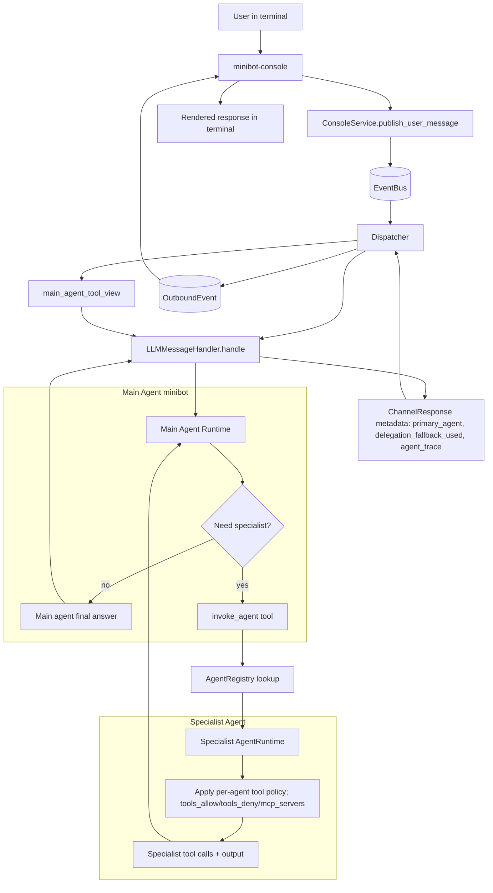

# Architecture Overview

This document describes the architecture that exists in the current repository.

MiniBot is an asyncio application with two runtime entrypoints:

- daemon mode (`minibot.app.daemon`) for Telegram,
- interactive CLI mode (`minibot.app.console`) for local console conversations.

Both entrypoints publish inbound events to an internal event bus, route messages through the LLM pipeline,
and emit outbound responses back to the active channel adapter.

## Guiding Principles

- Keep a lightweight hexagonal split: `core` (domain contracts), `app` (orchestration), `adapters` (infrastructure), `llm` (provider/tool integration).
- Prefer async-first boundaries for I/O-heavy paths (Telegram, DB, provider calls).
- Keep infrastructure replaceable behind protocols (memory repositories, scheduled prompt store, tools).
- Maintain explicit, testable flow with dependency wiring centralized in the container.

## Repository Layout (Current)

```text
.
├── ARCHITECTURE.md
├── README.md
├── TODO.md
├── config.example.toml
├── prompts/
│   └── channels/
│       └── telegram.md
├── Dockerfile
├── docker-compose.yml
├── minibot/
│   ├── app/
│   │   ├── agent_definitions_loader.py
│   │   ├── agent_policies.py
│   │   ├── agent_registry.py
│   │   ├── agent_runtime.py
│   │   ├── console.py
│   │   ├── daemon.py
│   │   ├── dispatcher.py
│   │   ├── event_bus.py
│   │   ├── llm_client_factory.py
│   │   ├── scheduler_service.py
│   │   ├── tool_capabilities.py
│   │   └── handlers/
│   │       └── llm_handler.py
│   ├── core/
│   │   ├── agent_runtime.py
│   │   ├── agents.py
│   │   ├── channels.py
│   │   ├── events.py
│   │   ├── jobs.py
│   │   └── memory.py
│   ├── adapters/
│   │   ├── config/
│   │   │   ├── loader.py
│   │   │   └── schema.py
│   │   ├── container/
│   │   │   └── app_container.py
│   │   ├── logging/
│   │   │   └── setup.py
│   │   ├── mcp/
│   │   │   └── client.py
│   │   ├── files/
│   │   │   └── local_storage.py
│   │   ├── memory/
│   │   │   ├── sqlalchemy.py
│   │   │   └── kv_sqlalchemy.py
│   │   ├── messaging/
│   │   │   ├── console/
│   │   │   │   └── service.py
│   │   │   └── telegram/
│   │   │       └── service.py
│   │   └── scheduler/
│   │       └── sqlalchemy_prompt_store.py
│   ├── llm/
│   │   ├── provider_factory.py
│   │   └── tools/
│   │       ├── arg_utils.py
│   │       ├── agent_delegate.py
│   │       ├── base.py
│   │       ├── factory.py
│   │       ├── calculator.py
│   │       ├── chat_memory.py
│   │       ├── file_storage.py
│   │       ├── http_client.py
│   │       ├── mcp_bridge.py
│   │       ├── python_exec.py
│   │       ├── schema_utils.py
│   │       ├── scheduler.py
│   │       ├── time.py
│   │       └── user_memory.py
│   └── shared/
│       ├── console_compat.py
│       ├── parse_utils.py
│       ├── path_utils.py
│       ├── prompt_loader.py
│       └── utils.py
└── tests/
    └── ... (mirrors runtime modules)
```

## Runtime Flow

1. Entry point (`minibot.app.daemon` or `minibot.app.console`) boots settings, logging, memory, tools, and dispatcher.
2. Channel adapter (`TelegramService` or `ConsoleService`) maps input into `ChannelMessage` and publishes `MessageEvent`.
3. `MessageEvent` is published into `app.event_bus.EventBus`.
4. `app.dispatcher.Dispatcher` consumes `MessageEvent` and invokes `LLMMessageHandler`.
5. `Dispatcher` builds main-agent tool visibility first (`app.tool_capabilities.main_agent_tool_view`):
   - optional main-agent allow/deny tool policy,
   - optional exclusive ownership mode that hides agent-owned tools from the main agent.
6. Handler loads history, composes system prompt fragments, and builds tool context.
7. Main agent (`minibot`) runs in `AgentRuntime` with full tool loop.
8. Delegation is tool-driven:
   - main agent may call `invoke_agent`,
   - `invoke_agent` resolves specialist by name, applies agent tool policy, and runs specialist runtime with ephemeral in-turn state,
   - result returns to main agent as tool output, then main agent composes final answer.
9. Handler returns `ChannelResponse` with metadata (`primary_agent`, optional `agent_trace`, `delegation_fallback_used`, token trace).
10. Dispatcher publishes `OutboundEvent` unless `metadata.should_reply` is false.
11. Active channel adapter consumes outbound response and renders it to user (Telegram send or console print).

This design keeps channel I/O, model orchestration, and persistence decoupled while preserving a single async event spine.

## Console Agent Invocation Flow (Example)

Example request and agent invocation flow when using `minibot-console`.



## Core Domain Contracts

- `core/agents.py`: agent definitions (`AgentSpec`) and delegation payload (`DelegationDecision`).
- `core/agent_runtime.py`: runtime state/message/part model (`AgentState`, `AgentMessage`, `MessagePart`, limits/directives).
- `core/channels.py`: inbound/outbound DTOs (`ChannelMessage`, `ChannelResponse`) and message metadata; includes attachment payloads for multimodal inputs.
- `core/events.py`: event types (`MessageEvent`, `OutboundEvent`, base event envelope).
- `core/memory.py`: transcript and KV memory protocols.
- `core/jobs.py`: scheduled prompt entities, status enums, recurrence model, and repository protocol.

## Application Layer

- `app/event_bus.py`: in-process async pub/sub over `asyncio.Queue` with subscription iterators.
- `app/dispatcher.py`: main event consumer; builds enabled tools, applies main-agent tool visibility policy, invokes handler pipeline, controls reply suppression.
- `app/agent_definitions_loader.py`: loads specialist definitions from Markdown files with YAML-like frontmatter.
- `app/agent_registry.py`: in-memory registry for discovered `AgentSpec` entries.
- `app/agent_policies.py`: enforces per-agent tool scoping (`tools_allow`, `tools_deny`, MCP server allowlist).
- `app/tool_capabilities.py`: computes main-agent-visible tools and capability summaries for prompts/tool policies.
- `app/handlers/llm_handler.py`:
  - assembles model input from text plus attachments,
  - composes per-channel system prompt by loading prompt fragments from `shared/prompt_loader.py`,
  - runs main-agent runtime/tool loop,
  - consumes delegated results from `invoke_agent` tool outputs,
  - enforces provider constraints for multimodal support,
  - stores transcript history safely (attachment summaries only, not raw blobs),
  - parses structured model output (`answer`, `should_answer_to_user`).
- `app/agent_runtime.py`:
  - owns directive-loop execution (`provider step -> tool calls -> tool output append -> directive apply -> next step`),
  - maintains runtime `AgentState` (`messages`, `meta`),
  - renders managed-file directive parts into provider multimodal payloads,
  - enforces loop limits (`max_steps`, `max_tool_calls`, timeout) and directive trust policy.
- `app/llm_client_factory.py`: builds/caches default and per-agent LLM clients, resolving credentials from `[providers.<name>]`.
- `app/scheduler_service.py`: scheduled prompt orchestration (`schedule`, `list`, `cancel`, `delete`, polling loop, retry/recurrence handling, event publishing).
- `app/console.py`: interactive `minibot-console` runner on top of `ConsoleService` + dispatcher.

## Agent Architecture (Current)

- Agent definitions live in `agents/*.md`:
  - frontmatter describes identity/routing/runtime policy (`name`, `description`, `model_provider`, `model`, `max_tool_iterations`, `tools_allow`, `tools_deny`, `mcp_servers`),
  - Markdown body becomes the specialist system prompt.
- `AppContainer` always loads those files at boot and builds `AgentRegistry`; disabled agents are filtered by frontmatter `enabled: false`.
- `Dispatcher` computes main-agent tool exposure via `tool_ownership_mode`:
  - `shared`: main agent keeps tools after main-agent allow/deny policy,
  - `exclusive`: tools available to specialists are hidden from main agent.
- Delegation is executed by `invoke_agent` tool:
  1. validate requested specialist name,
  2. instantiate specialist client (provider/model overrides supported),
  3. filter tools by specialist policy,
  4. run specialist runtime with ephemeral in-turn state (no delegated SQLite transcript),
  5. return tool result to main agent for final answer synthesis.
- Metadata emitted includes execution trace (`primary_agent`, `delegation_fallback_used`, `agent_trace`).
- Recursive delegation is blocked for specialists by removing `invoke_agent` from specialist tool scope.

Current notes:

- Agent subsystem is always available; there is no global enable/disable switch.

## Infrastructure Adapters

- Config:
  - `adapters/config/schema.py` holds Pydantic settings models.
  - `adapters/config/loader.py` resolves TOML + environment placeholders.
- Container:
  - `adapters/container/app_container.py` wires singleton-style service graph.
- Logging:
  - `adapters/logging/setup.py` configures structured logfmt-friendly logging.
- Messaging:
  - `adapters/messaging/console/service.py` handles local console I/O with EventBus publish/subscribe semantics.
  - `adapters/messaging/telegram/service.py` handles Telegram authorization, inbound text/media extraction, outbound message sending, and long-message chunking.
- Files:
  - `adapters/files/local_storage.py` handles managed workspace path-safe list/write/read operations.
- MCP:
  - `adapters/mcp/client.py` provides MCP JSON-RPC clients over stdio and HTTP (including HTTP session header reuse).
- Memory:
  - `adapters/memory/sqlalchemy.py` persists chat history.
  - `adapters/memory/kv_sqlalchemy.py` persists KV tool memory.
- Scheduler persistence:
  - `adapters/scheduler/sqlalchemy_prompt_store.py` stores scheduled prompts in SQLite via SQLAlchemy.

## LLM Layer

- `llm/provider_factory.py`: provider/client abstraction around `sonic182/llm-async`, including tool execution loops and provider capability branching.
- `llm/tools/factory.py`: builds enabled tool bindings from settings.
- `llm/tools/*`: concrete tool schemas + handlers:
  - agent delegation (`list_agents`, `invoke_agent`),
  - chat memory management,
  - calculator,
  - HTTP client,
  - user/KV memory,
  - Python execution,
  - file storage/workspace tools (`list_files`, `create_file`, `move_file`, `delete_file`, `send_file`, `self_insert_artifact`),
  - scheduler controls (`schedule_prompt`, `cancel_scheduled_prompt`, `list_scheduled_prompts`, `delete_scheduled_prompt`),
  - time helpers.

## MCP Tool Bridge Flow

When MCP is enabled, tool registration and invocation follow this flow:

1. `llm/tools/factory.py` checks `settings.tools.mcp.enabled` and iterates configured `tools.mcp.servers`.
2. For each server, `MCPClient.list_tools_blocking()` performs discovery via JSON-RPC `tools/list` using either stdio or HTTP transport.
3. `MCPToolBridge.build_bindings()` filters discovered tools (`enabled_tools`/`disabled_tools`) and creates local LLM tool bindings.
4. Generated tool names follow `<name_prefix>_<server_name>__<remote_tool_name>` to keep each server namespace explicit.
5. On tool invocation, bridge handlers map local names back to remote tool names and call `MCPClient.call_tool_blocking(...)`.
6. Tool results are normalized before returning to runtime (content arrays are flattened into text when needed).

Transport details:

- Stdio transport keeps a subprocess per server, serializes I/O with asyncio locks, and performs initialize/initialized handshake.
- HTTP transport sends JSON-RPC requests to `url` and reuses `mcp-session-id` when provided by the server response headers.

Security boundary:

- MCP tools expose external capabilities. Use per-server `enabled_tools`/`disabled_tools` to enforce least privilege.

## Scheduler Model (Current)

The scheduler currently focuses on scheduled prompts (not a generic task DAG engine).

- Jobs are persisted in SQLite (`scheduled_prompts` table).
- Service leases due jobs, dispatches them through the event bus, retries failures with backoff, and supports interval recurrence.
- Scope checks enforce owner/channel/chat/user constraints for cancel/delete/list operations.
- Deletion is explicit user-triggered behavior; active jobs are cancelled before hard delete.

## Multimodal Input Path (Telegram -> LLM)

- Telegram adapter can ingest `photo` and `document` updates when media is enabled in config.
- Attachments are normalized into Responses-style parts:
  - images -> `input_image` (data URL),
  - non-image docs -> `input_file`.
- Handler sends multimodal content only when provider mode supports it (`openai_responses` path).
- For non-supporting providers, handler returns a clear user-facing message and avoids invalid provider calls.

## Data and State

- Conversation history: SQLite transcript store (optional max-history trimming).
- KV notes: optional SQLAlchemy-backed store under tool controls.
- Scheduled prompts: SQLite prompt store with recurrence + retry metadata.
- Runtime queue state: in-process, ephemeral, reconstructed on restart from durable stores.

## Configuration Surface

`config.example.toml` is the canonical reference (with inline notes for production-oriented values).

Main sections:

- `[runtime]`
- `[channels.telegram]` (auth allowlists, mode, media limits)
- `[llm]`
  - `llm.prompts_dir` points to channel prompt packs (default `./prompts`)
- `[orchestration]` (definitions directory, delegated runtime timeout defaults, main-agent policy)
- `[orchestration.main_agent]` (main-agent tool allow/deny)
- `[memory]`
- `[scheduler.prompts]`
- `[tools.*]` (`kv_memory`, `http_client`, `calculator`, `python_exec`, `time`, `mcp`)
- `[logging]`

Agent definition files under `./agents` are part of the effective config surface.

## Testing Strategy

- Unit and integration-style tests under `tests/` mirror runtime modules.
- Coverage focuses on config loading, event bus behavior, handler/tool flows, scheduler persistence/service behavior, provider interface, and Telegram adapter authorization/media mapping.
- Async paths are validated with `pytest` + `pytest-asyncio`.

## Current Boundaries and Future Extensions

Current architecture supports:

- daemon Telegram channel and interactive console channel,
- one daemon process with in-process event bus,
- SQLite-backed persistence for memory and scheduled prompts,
- tool-augmented LLM interactions,
- main-agent-driven tool-based delegation (`invoke_agent`) with per-agent tool scoping.

Natural extension points already in place:

- add new messaging adapters under `adapters/messaging/`,
- add alternative persistence adapters behind existing protocols,
- add richer control-plane interfaces (HTTP/WebSocket) without rewriting core dispatch flow,
- evolve scheduled prompts into broader task orchestration while preserving event bus contracts,
- extend single-hop delegation into deeper orchestration if/when recursive delegation is introduced.
