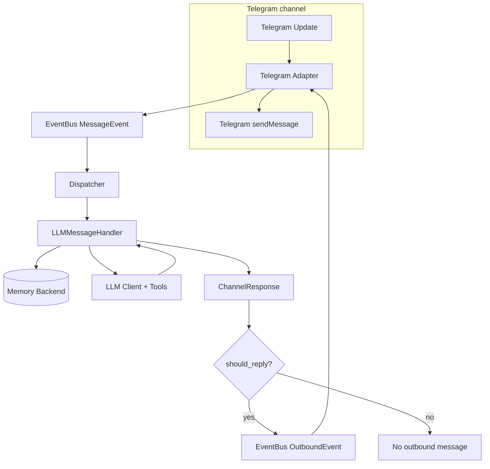

MiniBot 🤖
=======

Your personal AI assistant for Telegram - self-hosted, auditable, and intentionally opinionated.

Overview
--------

MiniBot is a lightweight personal AI assistant you run on your own infrastructure. It is built for people
who want reliable automation and chat assistance without a giant platform footprint.

The project is intentionally opinionated: Telegram-first, SQLite-first, async-first. You get a focused,
production-practical bot with clear boundaries, predictable behavior, and enough tools to be useful daily.

Quickstart
----------

1. `poetry install`
2. `cp config.example.toml config.toml`
3. Populate secrets in `config.toml` (bot token, allowed chat IDs, provider key).
4. `poetry run minibot`

Up & Running with Telegram
---------------------------

1. Launch Telegram [`@BotFather`](https://t.me/BotFather) and create a bot to obtain a token.
2. Update `config.toml`:
   * set `channels.telegram.bot_token`
   * populate `allowed_chat_ids` or `allowed_user_ids` with your ID numbers
   * configure the LLM provider section (`provider`, `api_key`, `model`)
3. Run `poetry run minibot` and send a message to your bot. Expect a simple synchronous reply (LLM, memory backed).
4. Monitor `logs` (Logfmt via `logfmter`) and `htmlcov/index.html` for coverage during dev.

Top features
------------

- 🤖 Personal assistant, not SaaS: your chats, memory, and scheduled prompts stay in your instance.
- 🎯 Opinionated by design: Telegram-centric flow, small tool surface, and explicit config over hidden magic.
- 🏠 Self-hostable: Dockerfile + docker-compose provided for easy local deployment.
- 💬 Telegram channel with chat/user allowlists and long-polling or webhook modes; accepts text, images, and file uploads (multimodal inputs when enabled).
- 🧠 Focused provider support (via [llm-async]): currently `openai`, `openai_responses`, and `openrouter` only.
- 🖼️ Multimodal support: media inputs (images/documents) are supported with `llm.provider = "openai_responses"`, `"openai"`, and `"openrouter"`. `openai_responses` uses Responses API content types; `openai`/`openrouter` use Chat Completions content types.
- 🧰 Small, configurable tools: chat memory, KV notes, HTTP fetch, calculator, current_datetime, and optional Python execution.
- 🌐 Optional browser automation with Playwright (`browser_navigate`, `browser_info`, `browser_get_data`, `browser_wait_for`, `browser_click`, `browser_query_selector`, `browser_close`).
- ⏰ Scheduled prompts (one-shot and interval recurrence) persisted in SQLite.
- 📊 Structured logfmt logs, request correlation IDs, and a focused test suite (`pytest` + `pytest-asyncio`).

Why self-host
-------------

- Privacy & ownership: all transcripts, KV notes, and scheduled prompts are stored in your instance (SQLite files), not a third-party service.
- Cost & provider control: pick where to route LLM calls and manage API usage independently.
- Network & runtime control: deploy behind your firewall, restrict outbound access, and run the daemon as an unprivileged user.

Configuration Reference
-----------------------

Use `config.example.toml` as the source of truth—copy it to `config.toml` and update secrets before launching. Key sections:

- Byte-size fields accept raw integers or quoted size strings; SI units are preferred in examples (for example `"16KB"`, `"5MB"`, `"2GB"`). IEC units are also accepted (for example `"16KiB"`, `"5MiB"`).

- `[runtime]`: global flags such as log level and environment.
- `[channels.telegram]`: enables the Telegram adapter, provides the bot token, and lets you whitelist chats/users plus set polling/webhook mode.
- `[llm]`: configures the chosen [llm-async] provider (currently `openai`, `openai_responses`, or `openrouter`), plus API key, model, optional temperature/token/reasoning params, `max_tool_iterations`, and system prompt. Request params are only sent when present in `config.toml` (omit keys like `temperature`, `max_new_tokens`, or `reasoning_effort` to avoid sending them). For OpenRouter, optional `llm.openrouter.models` lets you provide a fallback model pool, `llm.openrouter.provider` lets you send routing controls (`order`, `allow_fallbacks`, `only`, `ignore`, `sort`, throughput/latency preferences, `max_price`, and `provider_extra` for future keys), and `llm.openrouter.plugins` lets you pass request plugins (for example `file-parser` PDF engine selection).
- `[memory]`: conversation history backend (default SQLite). The `SQLAlchemyMemoryBackend` stores session exchanges so `LLMMessageHandler` can build context windows. `max_history_messages` optionally enables automatic trimming of old transcript messages after each user/assistant append; when unset, transcript retention is unlimited.
- `[scheduler.prompts]`: configures delayed prompt execution storage/polling and recurrence safety (`min_recurrence_interval_seconds` guards interval jobs).
- `[tools.kv_memory]`: optional key/value store powering the KV tools. It has its own database URL, pool/echo tuning, and pagination defaults. Enable it only when you need tool-based memory storage.
- `[tools.http_client]`: toggles the HTTP client tool. Configure timeout + `max_bytes` (raw byte cap), optional `max_chars` (LLM-facing char cap), and `response_processing_mode` (`auto`/`none`) for response shaping via [aiosonic].
- `[tools.playwright]`: enables browser automation with Playwright. Configure `browser` (`chromium`, `firefox`, `webkit`), Chromium `launch_channel` (for example `chrome`) and optional `chromium_executable_path`, launch args, browser fingerprint/context defaults (UA, viewport, locale, timezone, geolocation, headers), output caps, session TTL, and egress restrictions (`allowed_domains`, `allow_http`, `block_private_networks`). Browser outputs can be post-processed in Python before reaching the LLM (`postprocess_outputs`, enabled by default), with optional raw snapshot exposure (`postprocess_expose_raw`) and a snapshot cache TTL (`postprocess_snapshot_ttl_seconds`). Post-processed text is emitted as compact Markdown with links preserved.
- `[tools.calculator]`: controls the built-in arithmetic calculator tool (enabled by default) with Decimal precision, expression length limits, and exponent guardrails.
- `[tools.python_exec]`: configures host Python execution with interpreter selection (`python_path`/`venv_path`), timeout/output/code caps, environment policy, and optional pseudo-sandbox modes (`none`, `basic`, `rlimit`, `cgroup`, `jail`).
- `[logging]`: structured log flags (logfmt, separators) consumed by `adapters/logging/setup.py`.

Every section has comments + defaults in `config.example.toml`—read that file for hints.

Scheduler Guide
---------------

Schedule by chatting naturally. MiniBot understands reminders for one-time and recurring prompts, and keeps
jobs persisted in SQLite so they survive restarts.

Use plain prompts like:

- "Remind me in 30 minutes to check my email."
- "At 7:00 AM tomorrow, ask me for my daily priorities."
- "Every day at 9 AM, remind me to send standup."
- "List my active reminders."
- "Cancel the standup reminder."

Notes:

- One-time and recurring reminders are supported.
- Recurrence minimum interval is `scheduler.prompts.min_recurrence_interval_seconds` (default `60`).
- Configure scheduler storage/polling under `[scheduler.prompts]` in `config.toml`.

- Typical flow: ask for a reminder in plain language, then ask to list/cancel it later if needed.

Security & sandboxing
---------------------

MiniBot intentionally exposes a very limited surface of server-side tools. The most sensitive capability is
`python_execute`, which can run arbitrary Python code on the host if enabled. Treat it as a powerful but
potentially dangerous tool and follow these recommendations:

- Disable `tools.python_exec` unless you need it; toggle it via `config.example.toml`.
- Prefer non-host execution or explicit isolation when executing untrusted code (`sandbox_mode` options include `rlimit`, `cgroup`, and `jail`).
- If using `jail` mode, configure `tools.python_exec.jail.command_prefix` to wrap execution with a tool like Firejail and restrict filesystem/network access.
- Run the daemon as a non-privileged user, mount only required volumes (data directory) and avoid exposing sensitive host paths to the container.

Example `jail` command prefix (set in `config.toml`):

```toml
[tools.python_exec.jail]
enabled = true
command_prefix = ["firejail", "--private=/srv/minibot-sandbox", "--net=none", "--quiet"]
```

Note: ensure the wrapper binary (e.g. `firejail`) is available in your runtime image or host. The Dockerfile in this repo installs `firejail` by default for convenience; review its flags carefully before use.

Stage 1 targets:

1. Telegram-only channel with inbound/outbound DTO validation via `pydantic`.
2. SQLite/SQLAlchemy-backed conversation memory for context/history.
3. Structured `logfmter` logs with request correlation and event bus-based dispatcher.
4. Pytest + pytest-asyncio tests for config, event bus, memory, and handler plumbing.

Mini Hex Architecture
---------------------

MiniBot follows a lightweight hexagonal layout described in detail in `ARCHITECTURE.md`. The repository root keeps
`minibot/` split into:

- `core/` – Domain entities and protocols (channel DTOs, memory contracts, future job models).
- `app/` – Application services such as the daemon, dispatcher, handlers, and event bus that orchestrate domain + adapters.
- `adapters/` – Infrastructure edges (config, messaging, logging, memory, scheduler persistence) wired through the
  DI container.
- `llm/` – Thin wrappers around [llm-async] providers plus `llm/tools/`, which defines tool schemas/handlers that expose bot capabilities (KV memory, scheduler controls, utilities) to the model.
- `shared/` – Cross-cutting utilities.

Tests under `tests/` mirror this structure so every layer has a corresponding suite. This “mini hex” keeps the domain
pure while letting adapters evolve independently.

Incoming Message Flow
---------------------



Playwright (optional)
---------------------

Use Playwright when you want browser navigation and extraction tools (`browser_*`).

Setup:

1. `poetry install --extras playwright`
2. `poetry run playwright install chromium`
3. Linux only: `poetry run playwright install-deps chromium`

`playwright` extra installs all browser-tool runtime deps: `playwright`, `selectolax`, and `markdownify`.
If you install packages manually, install all three.

Quick local config:

```toml
[tools.playwright]
enabled = true
```

Safer production baseline:

```toml
[tools.playwright]
enabled = true
browser = "chromium"
headless = true
allow_http = false
block_private_networks = true
allowed_domains = ["example.com", "docs.example.com"]
```

Notes:

- Prefer `headless = true` on servers.
- Keep `allowed_domains` non-empty when possible.
- If you use Debian system Chromium, set `launch_channel = ""` and optionally `chromium_executable_path = "/usr/bin/chromium"`.

Tooling
-------

Tools live under `minibot/llm/tools/` and are exposed to [llm-async] with server-side execution controls.

- 🧠 `chat_history`: inspect/trim chat transcript history for the current session.
- 🧮 `calculate_expression` + 🕒 `current_datetime`: quick built-in utility tools.
- 📝 `kv_memory`: save/get/search short notes.
- 🌐 `http_client`: guarded HTTP/HTTPS fetches via [aiosonic].
- ⏰ `schedule_prompt`, `list_scheduled_prompts`, `cancel_scheduled_prompt`, `delete_scheduled_prompt`: one-time and recurring reminder scheduling.
- 🐍 `python_execute` + `python_environment_info`: optional host Python execution and runtime/package inspection.
- 🧭 `browser_*` (optional): Playwright navigation and extraction with domain/network guardrails.
- 🖼️ Telegram media inputs (`photo`/`document`) are supported on `openai_responses`, `openai`, and `openrouter`.

Conversation context:

- Uses a rolling history window (`get_history` default `32` messages), not full lifetime transcript.
- In OpenAI Responses mode, turns are rebuilt from stored history (no `previous_response_id` reuse).

Roadmap / Todos
---------------

- [ ] Add more channels: WhatsApp, Discord — implement adapters under `adapters/messaging/<channel>` reusing the event bus and dispatcher.
- [ ] Minimal web UI for analytics & debug — a small FastAPI control plane + lightweight SPA to inspect events, scheduled prompts, and recent logs.

[llm-async]: https://github.com/sonic182/llm-async
[aiosonic]: https://github.com/sonic182/aiosonic
