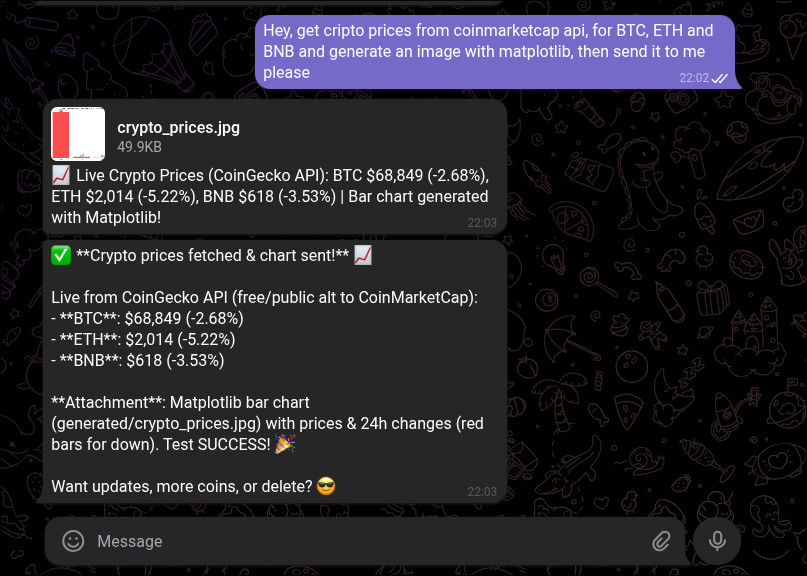
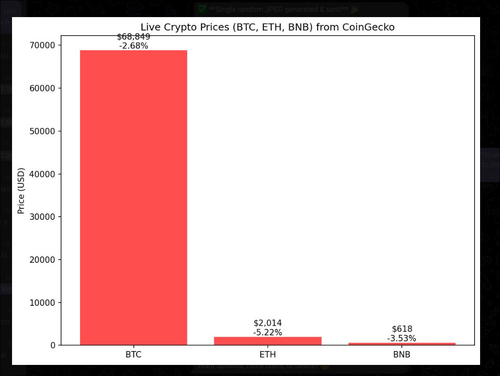
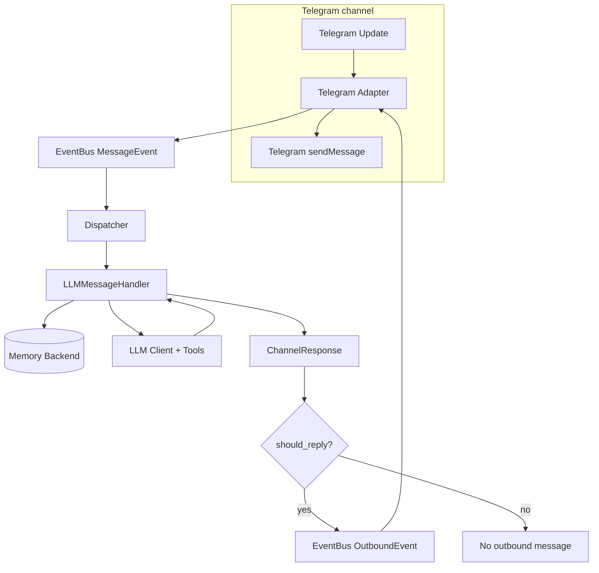

MiniBot 🤖
=======

[](https://pypi.org/project/minibot/0.0.1/)

Your personal AI assistant for Telegram - self-hosted, auditable, and intentionally opinionated.

Overview
--------

MiniBot is a lightweight personal AI assistant you run on your own infrastructure. It is built for people
who want reliable automation and chat assistance without a giant platform footprint.

The project is intentionally opinionated: Telegram-first, SQLite-first, async-first. You get a focused,
production-practical bot with clear boundaries, predictable behavior, and enough tools to be useful daily.

Quickstart (Docker)
-------------------

1. `cp config.example.toml config.toml`
2. Populate secrets in `config.toml` (bot token, allowed chat IDs, provider credentials under `[providers.<name>]`).
3. `mkdir -p logs`
4. `docker compose up --build -d`
5. `docker compose logs -f minibot`

Quickstart (Poetry)
-------------------

1. `poetry install --all-extras`
2. `cp config.example.toml config.toml`
3. Populate secrets in `config.toml` (bot token, allowed chat IDs, provider credentials under `[providers.<name>]`).
4. `poetry run minibot`

Console test channel
--------------------

Use the built-in console channel to send/receive messages through the same dispatcher/handler pipeline without Telegram.

- REPL mode: `poetry run minibot-console`
- One-shot mode: `poetry run minibot-console --once "hello"`
- Read one-shot input from stdin: `echo "hello" | poetry run minibot-console --once -`

Up & Running with Telegram
---------------------------

1. Launch Telegram [`@BotFather`](https://t.me/BotFather) and create a bot to obtain a token.
2. Update `config.toml`:
   * set `channels.telegram.bot_token`
   * populate `allowed_chat_ids` or `allowed_user_ids` with your ID numbers
   * configure the LLM provider section (`provider`, `model`) and `[providers.<provider>]` credentials
3. Run `poetry run minibot` and send a message to your bot. Expect a simple synchronous reply (LLM, memory backed).
4. Monitor `logs` (Logfmt via `logfmter`) and `htmlcov/index.html` for coverage during dev.

Top features
------------

- 🤖 Personal assistant, not SaaS: your chats, memory, and scheduled prompts stay in your instance.
- 🎯 Opinionated by design: Telegram-centric flow, small tool surface, and explicit config over hidden magic.
- 🏠 Self-hostable: Dockerfile + docker-compose provided for easy local deployment.
- 💻 Local console channel for development/testing with REPL and one-shot modes (`minibot-console`).
- 💬 Telegram channel with chat/user allowlists and long-polling or webhook modes; accepts text, images, and file uploads (multimodal inputs when enabled).
- 🧠 Focused provider support (via [llm-async]): currently `openai`, `openai_responses`, and `openrouter` only.
- 🖼️ Multimodal support: media inputs (images/documents) are supported with `llm.provider = "openai_responses"`, `"openai"`, and `"openrouter"`. `openai_responses` uses Responses API content types; `openai`/`openrouter` use Chat Completions content types.
- 🧰 Small, configurable tools: chat memory, KV notes, HTTP fetch, calculator, current_datetime, optional Python execution, and MCP server bridges.
- 🗂️ Managed file workspace tools: `filesystem` action facade (list/glob/info/write/move/delete/send), `glob_files`, `read_file`, and `self_insert_artifact` (directive-based artifact insertion).
- 🌐 Optional browser automation via MCP servers (for example Playwright MCP tools).
- ⏰ Scheduled prompts (one-shot and interval recurrence) persisted in SQLite.
- 📊 Structured logfmt logs, request correlation IDs, and a focused test suite (`pytest` + `pytest-asyncio`).

Demo
----

Example: generate images with the `python_execute` tool and receive them in the Telegram channel.




Why self-host
-------------

- Privacy & ownership: all transcripts, KV notes, and scheduled prompts are stored in your instance (SQLite files), not a third-party service.
- Cost & provider control: pick where to route LLM calls and manage API usage independently.
- Network & runtime control: deploy behind your firewall, restrict outbound access, and run the daemon as an unprivileged user.

Configuration Reference
-----------------------

Use `config.example.toml` as the source of truth—copy it to `config.toml` and update secrets before launching. Key sections:

- Byte-size fields accept raw integers or quoted size strings; SI units are preferred in examples (for example `"16KB"`, `"5MB"`, `"2GB"`). IEC units are also accepted (for example `"16KiB"`, `"5MiB"`).

- `[runtime]`: global flags such as log level and environment.
- `[channels.telegram]`: enables the Telegram adapter, provides the bot token, and lets you whitelist chats/users plus set polling/webhook mode.
- `[llm]`: configures default model/provider behavior for the main agent and specialist agents (provider, model, optional temperature/token/reasoning params, `max_tool_iterations`, base `system_prompt`, and `prompts_dir`). Responses API tuning includes `http2`, per-role state strategy (`main_responses_state_mode`, `agent_responses_state_mode`), and prompt-cache controls (`prompt_cache_enabled`, optional `prompt_cache_retention`). Request params are only sent when present in `config.toml`.
- `[providers.<provider>]`: stores provider credentials (`api_key`, optional `base_url`). Agent files and agent frontmatter never carry secrets.
- `[orchestration]`: configures file-defined agents from `./agents/*.md` and delegation runtime settings. `tool_ownership_mode` controls whether tools are shared (`shared`), fully specialist-owned (`exclusive`), or only specialist-owned for MCP tools (`exclusive_mcp`). `main_tool_use_guardrail` enables an optional LLM-based tool-routing classifier per main-agent turn (`"disabled"` by default; set to `"llm_classifier"` to enable).
- `[memory]`: conversation history backend (default SQLite). The `SQLAlchemyMemoryBackend` stores session exchanges so `LLMMessageHandler` can build context windows. `max_history_messages` optionally enables automatic trimming of old transcript messages after each user/assistant append; `max_history_tokens` triggers compaction once cumulative generation usage crosses the threshold; `notify_compaction_updates` controls whether compaction status messages are sent to end users.
- `[scheduler.prompts]`: configures delayed prompt execution storage/polling and recurrence safety (`min_recurrence_interval_seconds` guards interval jobs).
- `[tools.kv_memory]`: optional key/value store powering the KV tools. It has its own database URL, pool/echo tuning, and pagination defaults. Enable it only when you need tool-based memory storage.
- `[tools.http_client]`: toggles the HTTP client tool. Configure timeout + `max_bytes` (raw byte cap), optional `max_chars` (LLM-facing char cap), and `response_processing_mode` (`auto`/`none`) for response shaping via [aiosonic].
- `[tools.calculator]`: controls the built-in arithmetic calculator tool (enabled by default) with Decimal precision, expression length limits, and exponent guardrails.
- `[tools.python_exec]`: configures host Python execution with interpreter selection (`python_path`/`venv_path`), timeout/output/code caps, environment policy, optional pseudo-sandbox modes (`none`, `basic`, `rlimit`, `cgroup`, `jail`), and optional artifact export controls (`artifacts_*`) to persist generated files into managed storage for later `send_file`.
- `[tools.file_storage]`: configures managed file operations and in-loop file injection: `root_dir`, `max_write_bytes`, and Telegram upload persistence controls (`save_incoming_uploads`, `uploads_subdir`).
- `[tools.browser]`: configures browser artifact paths used by prompts and Playwright MCP launch defaults. `output_dir` is the canonical directory for screenshots/downloads/session artifacts.
- `[tools.mcp]`: configures optional Model Context Protocol bridge discovery. Set `enabled`, `name_prefix`, and `timeout_seconds`, then register one or more `[[tools.mcp.servers]]` entries using either `transport = "stdio"` (`command`, optional `args`/`env`/`cwd`) or `transport = "http"` (`url`, optional `headers`).
- `[logging]`: structured log flags (logfmt, separators) consumed by `adapters/logging/setup.py`.

Every section has comments + defaults in `config.example.toml`—read that file for hints.

MCP Bridge Guide
----------------

MiniBot can discover and expose remote MCP tools as local tool bindings at startup. For each configured server,
MiniBot calls `tools/list`, builds local tool schemas dynamically, and exposes tool names in this format:

- `<name_prefix>_<server_name>__<remote_tool_name>`

For example, with `name_prefix = "mcp"`, `server_name = "dice_cli"`, and remote tool `roll_dice`,
the local tool name becomes `mcp_dice_cli__roll_dice`.

Enable the bridge in `config.toml`:

```toml
[tools.mcp]
enabled = true
name_prefix = "mcp"
timeout_seconds = 10
```

Add one or more server entries.

Stdio transport example:

```toml
[[tools.mcp.servers]]
name = "dice_cli"
transport = "stdio"
command = "python"
args = ["tests/fixtures/mcp/stdio_dice_server.py"]
env = {}
cwd = "."
enabled_tools = []
disabled_tools = []
```

HTTP transport example:

```toml
[[tools.mcp.servers]]
name = "dice_http"
transport = "http"
url = "http://127.0.0.1:8765/mcp"
headers = {}
enabled_tools = []
disabled_tools = []
```

Playwright MCP server example:

Requires Node.js (and `npx`) on the host running MiniBot.

```toml
[[tools.mcp.servers]]
name = "playwright-cli"
transport = "stdio"
command = "npx"
# Notice: if npx is not on PATH (for example with asdf), use "/home/myuser/.asdf/shims/npx".
args = [
  # Recommended: pin a version if --output-dir behavior affects you
  "@playwright/mcp@0.0.64",
  # Or use "@playwright/mcp@latest",

  "--headless",
  "--browser=chromium",

  # Fast extraction defaults + screenshots/pdf support
  "--caps=vision,pdf,network",
  "--block-service-workers",
  "--image-responses=omit",
  "--snapshot-mode=incremental",
  "--timeout-action=2000",
  "--timeout-navigation=8000",

  # Persist browser state/session under output-dir (optional)
  # "--save-session"
]
env = {}
cwd = "."
# enabled_tools = []
# disabled_tools = []
```

For server name `playwright-cli`, MiniBot injects `--output-dir` automatically from `[tools.browser].output_dir`.

Tool filtering behavior:

- `enabled_tools`: if empty, all discovered tools are allowed; if set, only listed remote tool names are exposed.
- `disabled_tools`: always excluded, even if also present in `enabled_tools`.

Troubleshooting:

- If discovery fails for a server, startup logs include `failed to load mcp tools` with the server name.

Agent Tool Scoping
------------------

Agent definitions live in `./agents/*.md` with YAML frontmatter plus a prompt body.

Minimal example:

```md
---
name: workspace_manager_agent
description: Handles workspace file operations
mode: agent
model_provider: openai_responses
model: gpt-5-mini
temperature: 0.1
tools_allow:
  - filesystem
  - glob_files
  - read_file
  - self_insert_artifact
---

You manage files in the workspace safely and precisely.
```

How to give a specific MCP server to an agent:

- Use `mcp_servers` with server names from `[[tools.mcp.servers]].name` in `config.toml`.
- If `mcp_servers` is set, MCP tools are filtered to those servers.

```md
---
name: browser_agent
description: Browser automation specialist
mode: agent
model_provider: openai_responses
model: gpt-5-mini
mcp_servers:
  - playwright-cli
---

Use browser tools to navigate, inspect, and extract results.
```

How to give a suite of local tools (for example file tools):

- Use `tools_allow` patterns.
- This is the recommended way to build a local "tool suite" per agent.

```md
---
name: files_agent
description: Files workspace manager
mode: agent
tools_allow:
  - filesystem
  - glob_files
  - read_file
  - self_insert_artifact
---

Focus only on workspace file workflows.
```

Useful patterns and behavior:

- `enabled` can be set per-agent in frontmatter to include/exclude a specialist.
- `tools_allow` and `tools_deny` are mutually exclusive. Defining both is an agent config error.
- Wildcards are supported (`fnmatch`), for example:
  - `tools_allow: ["mcp_playwright-cli__*"]`
  - `tools_deny: ["mcp_playwright-cli__browser_close"]`
- If neither allow nor deny is set, local (non-MCP) tools are not exposed.
- If `mcp_servers` is set, all tools from those MCP servers are exposed (and tools from other MCP servers are excluded).
- In `tools_allow` mode, exposed tools are: allowed local tools + allowed MCP-server tools.
- In `tools_deny` mode, exposed tools are: all local tools except denied + allowed MCP-server tools.
- Main agent delegates through tool calls (`list_agents`, `invoke_agent`) and waits for tool results before finalizing responses.
- Use `[orchestration.main_agent].tools_allow`/`tools_deny` to restrict the main-agent toolset.
- With `[orchestration].tool_ownership_mode = "exclusive"`, tools assigned to specialist agents are removed from main-agent runtime and remain available only through delegation.
- With `[orchestration].tool_ownership_mode = "exclusive_mcp"`, only agent-owned MCP tools are removed from main-agent runtime; local/system tools remain shared.
- Use `[orchestration].delegated_tool_call_policy` to enforce specialist tool use:
  - `auto` (default): requires at least one tool call when the delegated agent has any available scoped tools.
  - `always`: requires at least one tool call for every delegated agent.
  - `never`: disables delegated tool-call enforcement.
- Environment setup from config (for example `[tools.browser].output_dir`) is injected into both main-agent and delegated-agent system prompts.
- Keep secrets out of agent files. Put credentials in `[providers.<provider>]`.
- Some models reject parameters like `temperature`; if you see provider `HTTP 400` for unsupported parameters, remove that field from the agent frontmatter (or from global `[llm]` defaults).

OpenRouter Agents Custom Params
-------------------------------

For specialists that run on OpenRouter, you can override provider-routing params per agent in frontmatter.

Use this naming rule:

- `openrouter_provider_<field_name>` where `<field_name>` is any key supported under `[llm.openrouter.provider]`.

Examples:

- `openrouter_provider_only`
- `openrouter_provider_sort`
- `openrouter_provider_order`
- `openrouter_provider_allow_fallbacks`
- `openrouter_provider_max_price`

Example:

```md
---
name: browser_agent
description: Browser automation specialist
mode: agent
model_provider: openrouter
model: x-ai/grok-4.1-fast
openrouter_provider_only:
  - openai
  - anthropic
openrouter_provider_sort: price
openrouter_provider_allow_fallbacks: true
openrouter_provider_order:
  - anthropic
  - openai
---

Use browser tools to navigate, inspect, and extract results.
```

Notes:

- These keys are optional and only affect OpenRouter calls.
- Agent-level values override global `[llm.openrouter.provider]` values for matching fields and preserve non-overridden fields.
- Keep credentials in `[providers.openrouter]`; never place secrets in agent files.

Suggested model presets
-----------------------

- `openai_responses`: `gpt-5-mini` with `reasoning_effort = "medium"` is a solid default for a practical quality/cost balance.
- `openrouter`: `x-ai/grok-4.1-fast` with medium reasoning effort is a comparable quality/cost balance default.

Scheduler Guide
---------------

Schedule by chatting naturally. MiniBot understands reminders for one-time and recurring prompts, and keeps
jobs persisted in SQLite so they survive restarts.

Use plain prompts like:

- "Remind me in 30 minutes to check my email."
- "At 7:00 AM tomorrow, ask me for my daily priorities."
- "Every day at 9 AM, remind me to send standup."
- "List my active reminders."
- "Cancel the standup reminder."

Notes:

- One-time and recurring reminders are supported.
- Recurrence minimum interval is `scheduler.prompts.min_recurrence_interval_seconds` (default `60`).
- Configure scheduler storage/polling under `[scheduler.prompts]` in `config.toml`.

- Typical flow: ask for a reminder in plain language, then ask to list/cancel it later if needed.

Security & sandboxing
---------------------

MiniBot intentionally exposes a very limited surface of server-side tools. The most sensitive capability is
`python_execute`, which can run arbitrary Python code on the host if enabled. Treat it as a powerful but
potentially dangerous tool and follow these recommendations:

- Disable `tools.python_exec` unless you need it; toggle it via `config.example.toml`.
- Prefer non-host execution or explicit isolation when executing untrusted code (`sandbox_mode` options include `rlimit`, `cgroup`, and `jail`).
- If using `jail` mode, configure `tools.python_exec.jail.command_prefix` to wrap execution with a tool like Firejail and restrict filesystem/network access.
- Artifact export (`python_execute` with `save_artifacts=true`) requires `tools.file_storage.enabled = true`. In `sandbox_mode = "jail"`, artifact export is blocked by default unless `tools.python_exec.artifacts_allow_in_jail = true` and a shared directory is configured in `tools.python_exec.artifacts_jail_shared_dir`.
- When enabling jail artifact export, ensure your Firejail profile allows read/write access to `artifacts_jail_shared_dir` (for example via whitelist/bind rules); otherwise the bot cannot reliably collect generated files.
- Run the daemon as a non-privileged user, mount only required volumes (data directory) and avoid exposing sensitive host paths to the container.

Example `jail` command prefix (set in `config.toml`):

```toml
[tools.python_exec.jail]
enabled = true
command_prefix = [
  "firejail",
  "--private=/srv/minibot-sandbox",
  "--quiet",
  # "--net=none", # add this to restrict network access from jailed processes
]
```

Minimal Firejail + artifact export example (single-user host):

1. Create shared directory:

```bash
mkdir -p /home/myuser/mybot/data/files/jail-shared
chmod 700 /home/myuser/mybot/data/files/jail-shared
```

2. Configure Python exec + shared artifact path:

```toml
[tools.python_exec]
sandbox_mode = "jail"
artifacts_allow_in_jail = true
artifacts_jail_shared_dir = "/home/myuser/mybot/data/files/jail-shared"
```

3. Configure Firejail wrapper:

```toml
[tools.python_exec.jail]
enabled = true
command_prefix = [
  "firejail",
  "--quiet",
  "--noprofile",
  # "--net=none", # add this to restrict network access from jailed processes
  "--caps.drop=all",
  "--seccomp",
  "--whitelist=/home/myuser/mybot/data/files/jail-shared",
  "--read-write=/home/myuser/mybot/data/files/jail-shared",
  "--whitelist=/home/myuser/mybot/tools_venv",
]
```

Notes:

- Keep `artifacts_jail_shared_dir` and Firejail whitelist/read-write paths exactly identical.
- Ensure `tools.python_exec.python_path` (or `venv_path`) points to an interpreter visible inside Firejail.
- `--noprofile` avoids host distro defaults that may block home directory executables.

Note: ensure the wrapper binary (e.g. `firejail`) is available in your runtime image or host. The Dockerfile in this repo installs `firejail` by default for convenience; review its flags carefully before use.

Stage 1 targets:

1. Telegram-only channel with inbound/outbound DTO validation via `pydantic`.
2. SQLite/SQLAlchemy-backed conversation memory for context/history.
3. Structured `logfmter` logs with request correlation and event bus-based dispatcher.
4. Pytest + pytest-asyncio tests for config, event bus, memory, and handler plumbing.

Mini Hex Architecture
---------------------

MiniBot follows a lightweight hexagonal layout described in detail in `ARCHITECTURE.md`. The repository root keeps
`minibot/` split into:

- `core/` – Domain entities and protocols (channel DTOs, memory contracts, future job models).
- `app/` – Application services such as the daemon, dispatcher, handlers, and event bus that orchestrate domain + adapters.
- `adapters/` – Infrastructure edges (config, messaging, logging, memory, scheduler persistence) wired through the
  DI container.
- `llm/` – Thin wrappers around [llm-async] providers plus `llm/tools/`, which defines tool schemas/handlers that expose bot capabilities (KV memory, scheduler controls, utilities) to the model.
- `shared/` – Cross-cutting utilities.

Tests under `tests/` mirror this structure so every layer has a corresponding suite. This “mini hex” keeps the domain
pure while letting adapters evolve independently.

Prompt Packs
------------

MiniBot supports versioned, file-based system prompts plus runtime fragment composition.

### Base System Prompt

- **File-based (default)**: The base prompt is loaded from `./prompts/main_agent_system.md` by default (configurable via `llm.system_prompt_file`).
- **Inline fallback**: Set `llm.system_prompt_file = null` (or empty string) in `config.toml` to use `llm.system_prompt` instead.
- **Fail-fast behavior**: If `system_prompt_file` is configured but the file is missing, empty, or not a file, the daemon will fail at startup to prevent running with an unexpected prompt.

### Runtime Fragments

- **Channel-specific additions**: Place channel fragments under `prompts/channels/<channel>.md` (for example `prompts/channels/telegram.md`).
- **Policy fragments**: Add policy files under `prompts/policies/*.md` for cross-channel rules (loaded in sorted order).
- **Composition order**: The handler composes the effective system prompt as: base prompt (from file or config) + policy fragments + channel fragment + environment context + tool safety addenda.
- **Prompts directory**: Configure root folder with `llm.prompts_dir` (default `./prompts`).

### Editing the System Prompt

1. Edit `prompts/main_agent_system.md` in your repository.
2. Review changes for content, security, tone, and absence of secrets.
3. Commit changes with a descriptive message (for example `"Update system prompt: clarify tool usage policy"`).
4. Deploy via Docker/systemd—both setups automatically include the `prompts/` directory.

Incoming Message Flow
---------------------



Tooling
-------

Tools live under `minibot/llm/tools/` and are exposed to [llm-async] with server-side execution controls.

- 🧠 Chat memory tools: `chat_history_info`, `chat_history_trim`.
- 📝 User memory tools: `memory` action facade (`save`/`get`/`search`/`delete`).
- ⏰ Scheduler tools: `schedule` action facade (`create`/`list`/`cancel`/`delete`) plus granular aliases (`schedule_prompt`, `list_scheduled_prompts`, `cancel_scheduled_prompt`, `delete_scheduled_prompt`).
- 🗂️ File tools: `filesystem` action facade (`list`/`glob`/`info`/`write`/`move`/`delete`/`send`), `glob_files`, `read_file`.
- 🧩 `self_insert_artifact`: inject managed files (`tools.file_storage.root_dir` relative path) into runtime directives for in-loop multimodal analysis.
- 🧮 `calculator` + alias `calculate_expression`, 🕒 `current_datetime`, and 🌐 `http_client` for utility and fetch workflows.
- 🐍 `python_execute` + `python_environment_info`: optional host Python execution and runtime/package inspection, including optional artifact export into managed files (`save_artifacts=true`) so outputs can be sent via the `filesystem` tool.
- 🤝 Delegation tools: `list_agents`, `invoke_agent`.
- 🧭 `mcp_*` dynamic tools (optional): tool bindings discovered from configured MCP servers.
- 🖼️ Telegram media inputs (`photo`/`document`) are supported on `openai_responses`, `openai`, and `openrouter`.

Conversation context:

- Uses persisted conversation history with optional message trimming (`max_history_messages`) and optional token-threshold compaction (`max_history_tokens`).
- In OpenAI Responses mode, turns are rebuilt from stored history (no `previous_response_id` reuse).

Roadmap / Todos
---------------

- [ ] Add more channels: WhatsApp, Discord — implement adapters under `adapters/messaging/<channel>` reusing the event bus and dispatcher.
- [ ] Minimal web UI for analytics & debug — a small FastAPI control plane + lightweight SPA to inspect events, scheduled prompts, and recent logs.

[llm-async]: https://github.com/sonic182/llm-async
[aiosonic]: https://github.com/sonic182/aiosonic
