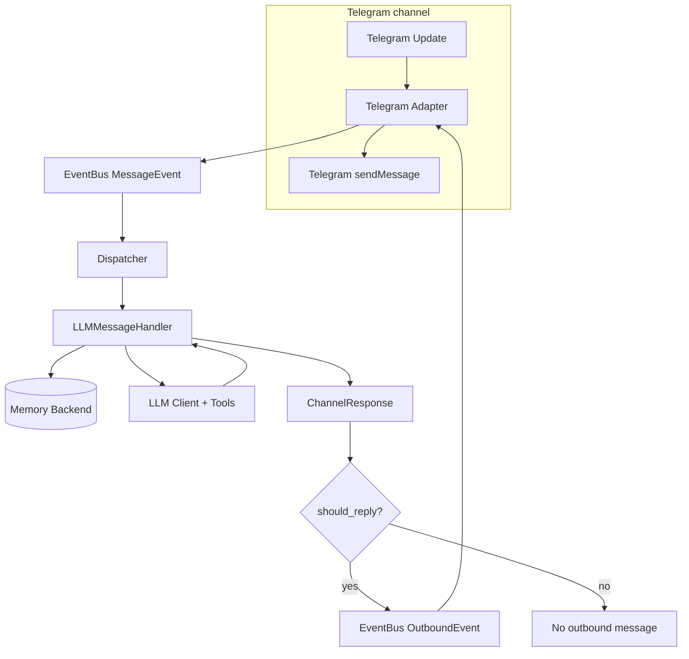

MiniBot
=======

Asynchronous Telegram assistant that routes user prompts through `sonic182/llm-async` providers.

Overview
--------

MiniBot is a lightweight, self-hosted Telegram assistant optimized for single-user or small-team use. It
routes chat messages to pluggable LLM providers, stores minimal local state (SQLite), and exposes a
small, auditable toolset so you can automate reminders, fetch HTTP resources, or run limited code in
controlled environments.

Top features
------------

- Self-hostable: Dockerfile + docker-compose provided for easy local deployment.
- Telegram channel with chat/user allowlists and long-polling or webhook modes; accepts text, images, and file uploads (multimodal inputs when enabled).
- Provider-agnostic LLM integration (via `sonic182/llm-async`) with explicit support for OpenAI Responses multimodal inputs.
 - Provider-agnostic LLM integration (via `sonic182/llm-async`) with explicit support for OpenAI Responses multimodal inputs.
 - Best experience (multimodal): set `llm.provider = "openai_responses"`. Currently only this provider supports mixing text, images and file/document inputs end-to-end.
- Small, configurable tools: chat memory, KV notes, HTTP fetch, calculator, current_datetime, and optional Python execution.
- Scheduled prompts (one-shot and interval recurrence) persisted in SQLite.
- Structured logfmt logs, request correlation IDs, and a focused test suite (`pytest` + `pytest-asyncio`).

Why self-host
-------------

- Privacy & ownership: all transcripts, KV notes, and scheduled prompts are stored in your instance (SQLite files), not a third-party service.
- Cost & provider control: pick where to route LLM calls and manage API usage independently.
- Network & runtime control: deploy behind your firewall, restrict outbound access, and run the daemon as an unprivileged user.

Security & sandboxing
---------------------

MiniBot intentionally exposes a very limited surface of server-side tools. The most sensitive capability is
`python_execute`, which can run arbitrary Python code on the host if enabled. Treat it as a powerful but
potentially dangerous tool and follow these recommendations:

- Disable `tools.python_exec` unless you need it; toggle it via `config.example.toml`.
- Prefer non-host execution or explicit isolation when executing untrusted code (`sandbox_mode` options include `rlimit`, `cgroup`, and `jail`).
- If using `jail` mode, configure `tools.python_exec.jail.command_prefix` to wrap execution with a tool like Firejail and restrict filesystem/network access.
- Run the daemon as a non-privileged user, mount only required volumes (data directory) and avoid exposing sensitive host paths to the container.

Example `jail` command prefix (set in `config.toml`):

```toml
[tools.python_exec.jail]
enabled = true
command_prefix = ["firejail", "--private=/srv/minibot-sandbox", "--net=none", "--quiet"]
```

Note: ensure the wrapper binary (e.g. `firejail`) is available in your runtime image or host. The Dockerfile in this repo installs `firejail` by default for convenience; review its flags carefully before use.

Stage 1 targets:

1. Telegram-only channel with inbound/outbound DTO validation via `pydantic`.
2. SQLite/SQLAlchemy-backed conversation memory for context/history.
3. Structured `logfmter` logs with request correlation and event bus-based dispatcher.
4. Pytest + pytest-asyncio tests for config, event bus, memory, and handler plumbing.

Mini Hex Architecture
---------------------

MiniBot follows a lightweight hexagonal layout described in detail in `ARCHITECTURE.md`. The repository root keeps
`minibot/` split into:

- `core/` – Domain entities and protocols (channel DTOs, memory contracts, future job models).
- `app/` – Application services such as the daemon, dispatcher, handlers, and event bus that orchestrate domain + adapters.
- `adapters/` – Infrastructure edges (config, messaging, logging, memory, scheduler persistence) wired through the
  DI container.
- `llm/` – Thin wrappers around `llm-async` providers plus `llm/tools/`, which defines tool schemas/handlers that expose bot capabilities (KV memory, scheduler controls, utilities) to the model.
- `shared/` – Cross-cutting utilities.

Tests under `tests/` mirror this structure so every layer has a corresponding suite. This “mini hex” keeps the domain
pure while letting adapters evolve independently.

Incoming Message Flow
---------------------



Quickstart
----------

1. `poetry install`
2. `cp config.example.toml config.toml`
3. Populate secrets in `config.toml` (bot token, allowed chat IDs, provider key).
4. `poetry run python -m minibot.app.daemon`

Up & Running with Telegram
---------------------------

1. Launch Telegram [`@BotFather`](https://t.me/BotFather) and create a bot to obtain a token.
2. Update `config.toml`:
   * set `channels.telegram.bot_token`
   * populate `allowed_chat_ids` or `allowed_user_ids` with your ID numbers
   * configure the LLM provider section (`provider`, `api_key`, `model`)
3. Run `poetry run python -m minibot.app.daemon` and send a message to your bot. Expect a simple synchronous reply (LLM, memory backed).
4. Monitor `logs` (Logfmt via `logfmter`) and `htmlcov/index.html` for coverage during dev.

Configuration Reference
-----------------------

Use `config.example.toml` as the source of truth—copy it to `config.toml` and update secrets before launching. Key sections:

- `[runtime]`: global flags such as log level and environment.
- `[channels.telegram]`: enables the Telegram adapter, provides the bot token, and lets you whitelist chats/users plus set polling/webhook mode.
- `[llm]`: configures the chosen `sonic182/llm-async` provider (provider id, API key, model, temperature/token flags, token limits, `max_tool_iterations`, system prompt, etc.). For `openai_responses` + models that reject reasoning params (for example `gpt-4.1-mini`), set `send_reasoning_effort = false`.
- `[memory]`: conversation history backend (default SQLite). The `SQLAlchemyMemoryBackend` stores session exchanges so `LLMMessageHandler` can build context windows. `max_history_messages` optionally enables automatic trimming of old transcript messages after each user/assistant append; when unset, transcript retention is unlimited.
- `[scheduler.prompts]`: configures delayed prompt execution storage/polling and recurrence safety (`min_recurrence_interval_seconds` guards interval jobs).
- `[tools.kv_memory]`: optional key/value store powering the KV tools. It has its own database URL, pool/echo tuning, pagination defaults, and `default_owner_id` so the server decides ownership without involving the LLM. Enable it only when you need tool-based memory storage.
- `[tools.http_client]`: toggles the HTTP client tool. Configure timeout + `max_bytes` (raw byte cap), optional `max_chars` (LLM-facing char cap), and `response_processing_mode` (`auto`/`none`) for response shaping via `aiosonic`.
- `[tools.calculator]`: controls the built-in arithmetic calculator tool (enabled by default) with Decimal precision, expression length limits, and exponent guardrails.
- `[tools.python_exec]`: configures host Python execution with interpreter selection (`python_path`/`venv_path`), timeout/output/code caps, environment policy, and optional pseudo-sandbox modes (`none`, `basic`, `rlimit`, `cgroup`, `jail`).
- `[logging]`: structured log flags (logfmt, separators) consumed by `adapters/logging/setup.py`.

Every section has comments + defaults in `config.example.toml`—read that file for hints.

Tooling
-------

Tools are defined under `minibot/llm/tools/`. Each tool binding exposes a schema to `sonic182/llm-async` and executes via the server-side handler with a controlled `ToolContext`. Current tools:

- `chat_memory` (system tool, always enabled): manages transcript memory for the current chat/session with `chat_memory_info` (message count) and `chat_memory_trim` (keep latest N, remove older). This only affects chat history, not KV memory.
- `calculate_expression` (system tool, enabled by default): safely evaluates arithmetic expressions with Decimal precision and support for `+`, `-`, `*`, `/`, `%`, `**`, parentheses, and unary signs.
- `current_datetime` (system tool, enabled by default): returns the current UTC datetime with an optional `strftime` format override.
- `python_execute` (system tool, enabled by default): executes arbitrary Python code on the host backend with configurable interpreter (`python_path` or `venv_path`) and optional isolation modes, including external jail wrapping (`sandbox_mode = "jail"` with `tools.python_exec.jail.command_prefix`, e.g. Firejail).
- `python_environment_info` (system tool, enabled by default): reports the runtime that `python_execute` uses and can list installed packages (with optional prefix filtering and limit) so the model can pick available libraries before execution.
- Telegram inbound media (`photo` / `document`) is supported only when `llm.provider = "openai_responses"`. This provider currently offers the only end-to-end multimodal path (text + images/files). Images are sent as data URLs (`input_image.image_url`) and documents are sent as `input_file.file_data` payloads.
- `kv_memory`: persists short notes and supports save/get/search operations without asking the LLM for `owner_id` (the server injects it).
- `http_client`: builds on `aiosonic` so the bot can fetch HTTP/HTTPS resources with strict method/timeout/output guards plus optional content-type-aware response processing; configure via `[tools.http_client]`.
- `schedule_prompt`: creates one-shot jobs (`run_at`/`delay_seconds`) and interval recurrence (`recurrence_type="interval"` + `recurrence_interval_seconds`). Missed intervals are skipped on wake-up; the next future run is scheduled to avoid backlog bursts. Minimum interval is controlled by `scheduler.prompts.min_recurrence_interval_seconds` (default `60`).
- `cancel_scheduled_prompt`: cancels a job by id when it belongs to the same owner/chat context.
- `delete_scheduled_prompt`: permanently removes a job by id when it belongs to the same owner/chat context. If the job is active (`pending`/`leased`), it is cancelled first, then deleted.
- `list_scheduled_prompts`: lists scheduled jobs for the same owner/chat context (`active_only` defaults to `true`).

Conversation-context behavior:

- The LLM receives the latest chat history window (`get_history` default limit is 32 messages), not the full lifetime transcript.
- For OpenAI Responses mode, the handler intentionally does not reuse `previous_response_id`; each turn is reconstructed from stored chat history so transcript trimming/reset behavior is respected.

Future tools (scheduler commands, external API calls, etc.) can live alongside these handlers and be toggled via config without touching the handler pipeline.

Roadmap / Todos
---------------

- [ ] Add more channels: WhatsApp, Discord — implement adapters under `adapters/messaging/<channel>` reusing the event bus and dispatcher.
- [ ] Minimal web UI for analytics & debug — a small FastAPI control plane + lightweight SPA to inspect events, scheduled prompts, and recent logs.
