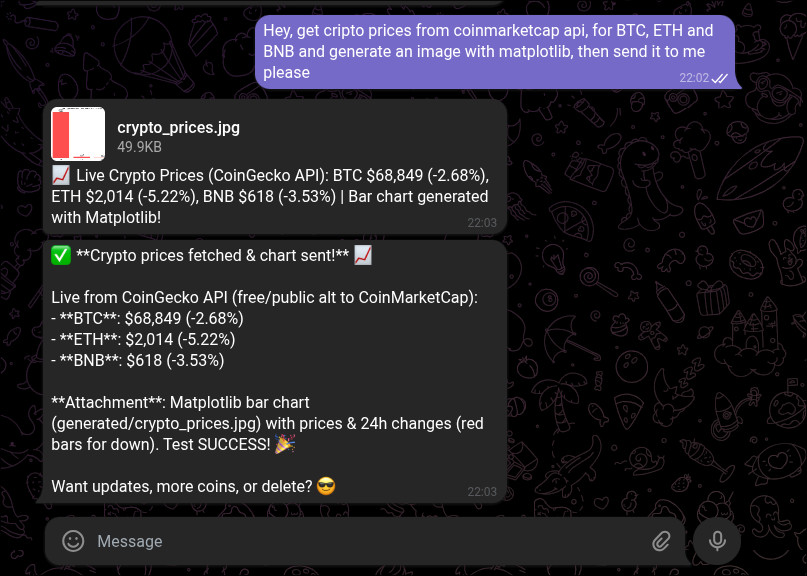
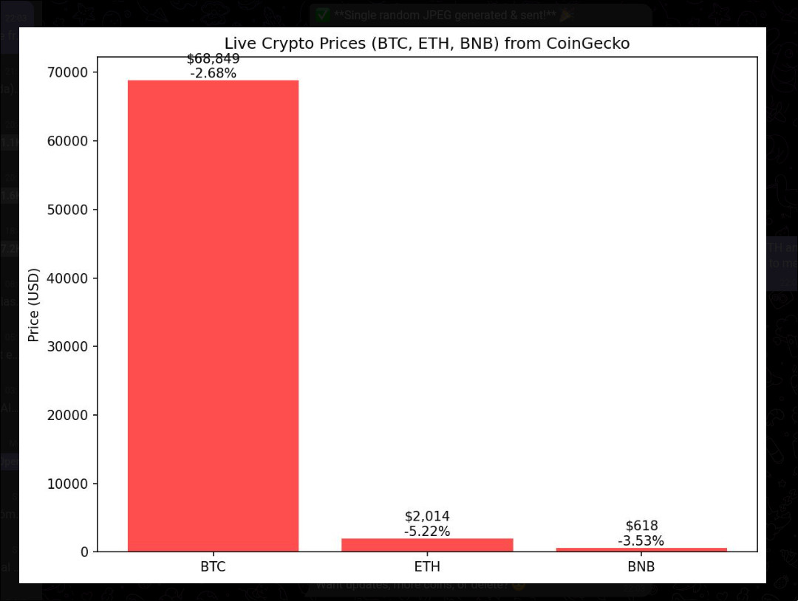

MiniBot 🤖
=======

Your personal AI assistant for Telegram - self-hosted, auditable, and intentionally opinionated.

📖 **[Full documentation](https://sonic182.github.io/minibot/)**

Top features
------------

- 🤖 Personal assistant, not SaaS: your chats, memory, and scheduled prompts stay in your instance.
- 🎯 Opinionated by design: Telegram-centric flow, small tool surface, and explicit config over hidden magic.
- 🏠 Self-hostable: Dockerfile + docker-compose provided for easy local deployment.
- 💻 Local console channel for development/testing without Telegram.
- 💬 Telegram channel with chat/user allowlists, long-polling or webhook modes, and multimodal inputs.
- 🧠 Provider support via [llm-async]: `openai`, `openai_responses`, `openrouter`, and more.
- 🧰 Configurable tools: chat memory, KV notes, HTTP fetch, calculator, datetime, Python execution, Bash, file storage, grep, speech-to-text, and MCP server bridges.
- ⏰ Scheduled prompts (one-shot and interval recurrence) persisted in SQLite.
- 🤝 Multi-agent orchestration with specialist agent definitions and skill packs.
- 📊 Structured logfmt logs and a focused async test suite.

Demo
----

Example: generate images with the `python_execute` tool and receive them in Telegram.

[llm-async]: https://github.com/sonic182/llm-async
