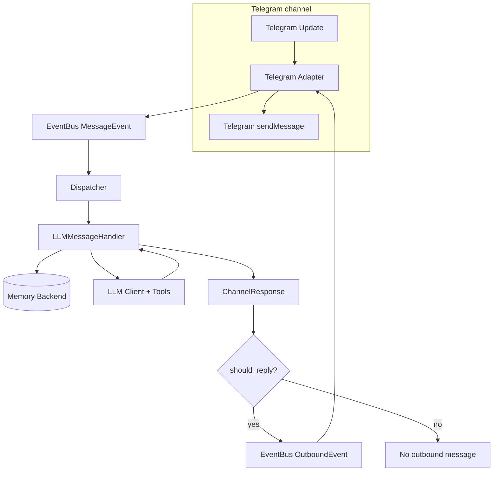

MiniBot 🤖
=======

[](https://pypi.org/project/minibot/)

Your personal AI assistant for Telegram - self-hosted, auditable, and intentionally opinionated.

## Table of Contents

**Introduction**
- [Top features](#top-features)
- [Demo](#demo)
- [Overview](#overview)
- [Why self-host](#why-self-host)

**Setup**
- [Quickstart (Docker)](#quickstart-docker)
- [Quickstart (Poetry)](#quickstart-poetry)
- [Up & Running with Telegram](#up--running-with-telegram)
- [Console test channel](#console-test-channel)
- [Using Ollama via OpenAI-Compatible API](#using-ollama-via-openai-compatible-api)
- [Optional Lua Support](#optional-lua-support)

**Configuration**
- [Configuration Reference](#configuration-reference)
- [Lua Config Notes](#lua-config-notes)
- [Scheduler Guide](#scheduler-guide)

**Hardware & Extras**
- [Telegram Audio Transcription (faster-whisper)](#telegram-audio-transcription-faster-whisper)
- [GPU Runtime Dependencies](#gpu-runtime-dependencies-debianubuntu-and-archmanjaro)
  - [Debian / Ubuntu](#debian--ubuntu)
  - [Arch / Manjaro](#arch--manjaro)
  - [Alternative: CUDA runtime libs in venv](#alternative-install-cuda-runtime-libs-inside-poetry-venv)
  - [Recommended STT config for GPU](#recommended-stt-config-for-gpu)
- [Lua Custom Tools](#lua-custom-tools)

**Advanced Features**
- [MCP Bridge Guide](#mcp-bridge-guide)
- [Agent Tool Scoping](#agent-tool-scoping)
- [Agent Skills](#agent-skills)
  - [Skill file format](#skill-file-format)
  - [Discovery paths](#discovery-paths)
  - [Recommended setup: `./skills`](#recommended-setup-skills)
  - [Overriding paths in `config.toml`](#overriding-paths-in-configtoml)
- [OpenRouter Agents Custom Params](#openrouter-agents-custom-params)
- [Suggested model presets](#suggested-model-presets)
- [Security & sandboxing](#security--sandboxing)
- [Prompt Packs](#prompt-packs)
  - [Base System Prompt](#base-system-prompt)
  - [Runtime Fragments](#runtime-fragments)
  - [Editing the System Prompt](#editing-the-system-prompt)

**Architecture & Internals**
- [Tooling](#tooling)
- [Mini Hex Architecture](#mini-hex-architecture)
- [Incoming Message Flow](#incoming-message-flow)

**Project**
- [Roadmap / Todos](#roadmap--todos)
- [Stage 1 targets](#stage-1-targets)

Top features
------------

- 🤖 Personal assistant, not SaaS: your chats, memory, and scheduled prompts stay in your instance.
- 🎯 Opinionated by design: Telegram-centric flow, small tool surface, and explicit config over hidden magic.
- 🏠 Self-hostable: Dockerfile + docker-compose provided for easy local deployment, including a full-capability `config.yolo.toml` / `config.yolo.lua` profile.
- 💻 Local console channel for development/testing with REPL and one-shot modes (`minibot-console`).
- 💬 Telegram channel with chat/user allowlists and long-polling or webhook modes; accepts text, images, and file uploads (multimodal inputs when enabled).
- 🧠 Focused provider support (via [llm-async]): currently `openai`, `openai_responses`, and `openrouter` only.
- 🖼️ Multimodal support: media inputs (images/documents) are supported with `llm.provider = "openai_responses"`, `"openai"`, and `"openrouter"`. `openai_responses` uses Responses API content types; `openai`/`openrouter` use Chat Completions content types.
- 🧰 Small, configurable tools: chat memory, KV notes, HTTP fetch, `calculate_expression`, `current_datetime`, optional Python execution, optional Bash execution, optional apply_patch editing, optional speech-to-text, and MCP server bridges.
- 🗂️ Managed file workspace tools: `filesystem` action facade (list/glob/info/write/move/delete/send), `glob_files`, `read_file`, `grep`, and `self_insert_artifact` (directive-based artifact insertion).
- 🌐 Optional browser automation via MCP servers (for example Playwright MCP tools).
- ⏰ Scheduled prompts (one-shot and interval recurrence) persisted in SQLite.
- 📊 Structured logfmt logs, request correlation IDs, and a focused test suite (`pytest` + `pytest-asyncio`).

Demo
----

Example: generate images with the `python_execute` tool and receive them in the Telegram channel.


Overview
--------

MiniBot is a lightweight personal AI assistant you run on your own infrastructure. It is built for people
who want reliable automation and chat assistance without a giant platform footprint.

The project is intentionally opinionated: Telegram-first, SQLite-first, async-first. You get a focused,
production-practical bot with clear boundaries, predictable behavior, and enough tools to be useful daily.

Why self-host
-------------

- Privacy & ownership: all transcripts, KV notes, and scheduled prompts are stored in your instance (SQLite files), not a third-party service.
- Cost & provider control: pick where to route LLM calls and manage API usage independently.
- Network & runtime control: deploy behind your firewall, restrict outbound access, and run the daemon as an unprivileged user.

Quickstart (Docker)
-------------------

1. `cp config.example.toml config.toml` or `cp config.example.lua config.lua`
2. Populate secrets in your config file (`channels.telegram.bot_token`, allowlists, provider credentials under `[providers.<name>]`).
3. `mkdir -p logs data`
4. `docker compose up --build -d`
5. `docker compose logs -f minibot`

`docker-compose.yml` mounts `config.toml` by default. If you prefer Lua config, mount `config.lua` instead or set `MINIBOT_CONFIG`.
`config.yolo.toml` / `config.yolo.lua` are provided as reference templates for users who want an all-enabled profile (file storage, STT, HTTP/KV tools, MCP bridge, unrestricted Python runtime with `sandbox_mode = "none"`, unrestricted Bash execution, and patch-based file editing).

Docker image includes:

- Python deps with all MiniBot extras (`stt`, `mcp`, `lua`)
- Node.js/npm (v24.14.0 from official Node.js tarball)
- Playwright + Chromium
- ffmpeg
- additional Python toolkit from `docker-requirements.txt`

Quickstart (Poetry)
-------------------

1. `poetry install --all-extras`
2. `cp config.example.toml config.toml` or `cp config.example.lua config.lua`
3. Populate secrets in your config file (bot token, allowed chat IDs, provider credentials under `[providers.<name>]`).
4. `poetry run minibot`

Up & Running with Telegram
---------------------------

1. Launch Telegram [`@BotFather`](https://t.me/BotFather) and create a bot to obtain a token.
2. Update `config.toml`:
   * set `channels.telegram.bot_token`
   * populate `allowed_chat_ids` or `allowed_user_ids` with your ID numbers
   * configure the LLM provider section (`provider`, `model`) and `[providers.<provider>]` credentials
3. Run `poetry run minibot` and send a message to your bot. Expect a simple synchronous reply (LLM, memory backed).
4. Monitor `logs` (Logfmt via `logfmter`) and `htmlcov/index.html` for coverage during dev.

Console test channel
--------------------

Use the built-in console channel to send/receive messages through the same dispatcher/handler pipeline without Telegram.

- REPL mode: `poetry run minibot-console`
- One-shot mode: `poetry run minibot-console --once "hello"`
- Read one-shot input from stdin: `echo "hello" | poetry run minibot-console --once -`

Using Ollama via OpenAI-Compatible API
--------------------------------------

MiniBot can use Ollama through Ollama's OpenAI-compatible endpoints with either:

- `llm.provider = "openai"` (Chat Completions style)
- `llm.provider = "openai_responses"` (Responses style, compatibility depends on Ollama/model support)

1. Start Ollama and pull a model:
   - `ollama serve`
   - `ollama pull qwen3.5:35b`
2. Set your MiniBot provider and model in `config.toml`.
3. Point provider `base_url` to Ollama's OpenAI-compatible path (`/v1`).
4. Set a non-empty `api_key` value in `[providers.openai]` / `[providers.openai_responses]` (for example `"dummy"`). MiniBot falls back to echo mode when this key is empty.

Example using `openai` provider:

```toml
[llm]
provider = "openai"
model = "qwen3.5:35b"
structured_output_mode = "provider_with_fallback"

[providers.openai]
api_key = "dummy"
base_url = "http://localhost:11434/v1"
```

Example using `openai_responses` provider:

```toml
[llm]
provider = "openai_responses"
model = "qwen3.5:35b"
structured_output_mode = "provider_with_fallback"

[providers.openai_responses]
api_key = "dummy"
base_url = "http://localhost:11434/v1"
```

Notes:

- Use `/v1` as the base path.
- Trailing slash in `base_url` is normalized by MiniBot, so both `/v1` and `/v1/` work.
- When `base_url` uses `http://`, MiniBot automatically disables HTTP/2 for compatibility.
- If a model/provider combination fails under `openai_responses`, switch to `openai` first.

Optional Lua Support
--------------------

MiniBot supports Lua as an optional extension layer for both config files and custom tools.

- Install it with `poetry install --extras lua` (or `poetry install --all-extras`).
- Lua config files are supported: copy `config.example.lua` → `config.lua` (gitignored, never committed), then populate your credentials.
- Lua custom tools are loaded from a configured directory via `[tools.lua_custom]` / `tools.lua_custom`.
- If the `lua` extra is not installed, the normal Python + TOML path still works; only Lua-backed features fail.

Configuration Reference
-----------------------

Use `config.example.toml` or `config.example.lua` as the source of truth, then update secrets before launching. Key sections:

- Byte-size fields accept raw integers or quoted size strings; SI units are preferred in examples (for example `"16KB"`, `"5MB"`, `"2GB"`). IEC units are also accepted (for example `"16KiB"`, `"5MiB"`).

- `[runtime]`: global flags such as log level and environment.
- `[channels.telegram]`: enables the Telegram adapter, provides the bot token, and lets you whitelist chats/users plus set polling/webhook mode.
- `[llm]`: configures default model/provider behavior for the main agent and specialist agents (provider, model, optional temperature/token/reasoning params, `max_tool_iterations`, base `system_prompt`, `prompts_dir`, and main-agent `structured_output_mode`). Responses API tuning includes `http2`, per-role state strategy (`main_responses_state_mode`, `agent_responses_state_mode`), and prompt-cache controls (`prompt_cache_enabled`, optional `prompt_cache_retention`). Request params are only sent when present in `config.toml`.
  - `structured_output_mode` applies to the main/orchestrator agent only: `provider_with_fallback` (default), `prompt_only`, or `provider_strict`.
  - For smaller/less schema-reliable models, prefer `prompt_only` (for example: `kimi-k2.5`, `glm-5`, `minimax-m2.5`).
  - OpenRouter note: when `reasoning_effort` is set, MiniBot sends `reasoning.enabled = true` together with `reasoning.effort`.
- `[providers.<provider>]`: stores provider credentials (`api_key`, optional `base_url`). Agent files and agent frontmatter never carry secrets.
- `[orchestration]`: configures file-defined agents from `./agents/*.md` and delegation runtime settings. `tool_ownership_mode` controls whether tools are shared (`shared`), fully specialist-owned (`exclusive`), or only specialist-owned for MCP tools (`exclusive_mcp`). `main_tool_use_guardrail` enables an optional LLM-based tool-routing classifier per main-agent turn (`"disabled"` by default; set to `"llm_classifier"` to enable).
- `[memory]`: conversation history backend (default SQLite). The `SQLAlchemyMemoryBackend` stores session exchanges so `LLMMessageHandler` can build context windows. `max_history_messages` optionally enables automatic trimming of old transcript messages after each user/assistant append; `max_history_tokens` triggers compaction once cumulative generation usage crosses the threshold; `context_ratio_before_compact` (default `0.95`) controls startup auto-derivation from `models.dev` limits; `notify_compaction_updates` controls whether compaction status messages are sent to end users.
  - Startup auto-config fetches `https://models.dev/api.json` once and, when limits are resolved for the configured model/provider, overrides runtime `max_history_tokens` and main/agent `max_new_tokens` for that process. If lookup fails, configured values are kept.
- `[scheduler.prompts]`: configures delayed prompt execution storage/polling and recurrence safety (`min_recurrence_interval_seconds` guards interval jobs).
- `[tools.kv_memory]`: optional key/value store powering the KV tools. It has its own database URL, pool/echo tuning, and pagination defaults. Enable it only when you need tool-based memory storage.
- `[tools.http_client]`: toggles the HTTP client tool. Configure timeout + `max_bytes` (raw byte cap), optional `max_chars` (LLM-facing char cap), and `response_processing_mode` (`auto`/`none`) for response shaping via [aiosonic].
- `[tools.calculator]`: controls the built-in arithmetic calculator tool (enabled by default) with Decimal precision, expression length limits, and exponent guardrails.
- `[tools.python_exec]`: configures host Python execution with interpreter selection (`python_path`/`venv_path`), timeout/output/code caps, environment policy, optional pseudo-sandbox modes (`none`, `basic`, `rlimit`, `cgroup`, `jail`), and optional artifact export controls (`artifacts_*`) to persist generated files into managed storage for later `send_file`.
- `[tools.bash]`: optional host Bash execution (`/bin/bash -lc`) with timeout/output caps plus environment controls (`pass_parent_env`, `env_allowlist`).
- `[tools.apply_patch]`: optional structured patch-editing tool using opencode-style `*** Begin Patch` format (`Add File`, `Update File`, `Delete File`, optional `Move to`), with configurable workspace restriction flags.
- `[tools.file_storage]`: configures managed file operations and in-loop file injection: `root_dir`, `max_write_bytes`, optional root confinement override (`allow_outside_root`), and Telegram upload persistence controls (`save_incoming_uploads`, `uploads_subdir`).
- `[tools.grep]`: optional text-search tool over files managed by `tools.file_storage`, with limits for `max_matches` and `max_file_size_bytes`.
- `[tools.audio_transcription]`: optional speech-to-text tool powered by `faster-whisper`; configure model/runtime defaults (`model`, `device`, `compute_type`, `beam_size`, `vad_filter`) plus short-audio auto-transcription policy (`auto_transcribe_short_incoming`, `auto_transcribe_max_duration_seconds`), and enable only when the `stt` extra is installed. Runtime decoding also requires ffmpeg available on the host.
- `[tools.lua_custom]`: optional Lua-defined custom tools loaded from a configured directory. Enable it only when the `lua` extra is installed; each `*.lua` file must return one tool manifest with `name`, `description`, `parameters`, and `handler(args)`.
- `[tools.browser]`: configures browser artifact paths used by prompts and Playwright MCP launch defaults. `output_dir` is the canonical directory for screenshots/downloads/session artifacts.
- `[tools.skills]`: configures skill discovery. Leave `paths` empty to use default locations (see Agent Skills section), or set `paths` to a non-empty list to override them entirely with your own directories. Set `enabled = false` to disable skill support.
- `[tools.mcp]`: configures optional Model Context Protocol bridge discovery. Set `enabled`, `name_prefix`, and `timeout_seconds`, then register one or more `[[tools.mcp.servers]]` entries using either `transport = "stdio"` (`command`, optional `args`/`env`/`cwd`) or `transport = "http"` (`url`, optional `headers`).
- `[logging]`: structured log flags (logfmt, separators) consumed by `adapters/logging/setup.py`.

Every section has comments + defaults in `config.example.toml` and `config.example.lua`—read the format you plan to use for hints.

Lua Config Notes
----------------

If you prefer Lua config:

- Start from `config.example.lua`.
- Provider keys can be read directly from the environment using `os.getenv(...)`.
- The Lua config file is executed locally and must `return` one top-level table matching the MiniBot settings shape.
- Without `lupa` installed, `.lua` config files will fail to load with an install hint.

For Docker full-stack startup, copy from `config.yolo.toml` into `config.toml` (or `config.yolo.lua` into `config.lua`) if you want pre-enabled tools + Playwright MCP server.

Scheduler Guide
---------------

Schedule by chatting naturally. MiniBot understands reminders for one-time and recurring prompts, and keeps
jobs persisted in SQLite so they survive restarts.

Use plain prompts like:

- "Remind me in 30 minutes to check my email."
- "At 7:00 AM tomorrow, ask me for my daily priorities."
- "Every day at 9 AM, remind me to send standup."
- "List my active reminders."
- "Cancel the standup reminder."

Notes:

- One-time and recurring reminders are supported.
- Recurrence minimum interval is `scheduler.prompts.min_recurrence_interval_seconds` (default `60`).
- Configure scheduler storage/polling under `[scheduler.prompts]` in `config.toml`.

- Typical flow: ask for a reminder in plain language, then ask to list/cancel it later if needed.

Telegram Audio Transcription (faster-whisper)
---------------------------------------------

Use this flow to transcribe audio sent through Telegram.

1. Install optional STT dependency:
   - `poetry install --extras stt`
2. Ensure ffmpeg is available on the host.
3. Enable managed files and transcription in `config.toml`:

```toml
[tools.file_storage]
enabled = true
root_dir = "./data/files"

[tools.audio_transcription]
enabled = true
model = "small"
device = "auto"
compute_type = "int8"
beam_size = 5
vad_filter = true
```

4. Send audio as a Telegram **document/file** attachment (for example `.mp3`, `.wav`, `.m4a`).
5. In the same message or a follow-up, ask the bot to transcribe it (example: `"transcribe this audio"`).

Notes:
- Telegram `voice` and `audio` message types are ingested by the adapter, as well as file/document uploads.
- If you restrict `channels.telegram.allowed_document_mime_types`, include your audio MIME types.
- In Docker yolo profile, whisper model assets are downloaded lazily on first transcription and cached under `/app/data/.cache`.

GPU Runtime Dependencies (Debian/Ubuntu and Arch/Manjaro)
----------------------------------------------------------

If STT fails with an error like `Library libcublas.so.12 is not found or cannot be loaded`, your CUDA runtime
libraries are missing from the loader path.

### Debian / Ubuntu

Install NVIDIA stack and CUDA/cuDNN runtime packages (package names vary by distro release):

```bash
sudo apt update
sudo apt install -y nvidia-driver nvidia-cuda-toolkit libcudnn9 libcudnn9-cuda-12
```

Ensure CUDA libs are visible to the dynamic linker:

```bash
echo '/usr/local/cuda/lib64' | sudo tee /etc/ld.so.conf.d/cuda.conf
sudo ldconfig
ldconfig -p | grep libcublas.so.12
```

### Arch / Manjaro

Install CUDA/cuDNN from pacman:

```bash
sudo pacman -Syu cuda cudnn
echo '/opt/cuda/lib64' | sudo tee /etc/ld.so.conf.d/cuda.conf
sudo ldconfig
ldconfig -p | grep libcublas.so.12
```

### Alternative: install CUDA runtime libs inside Poetry venv

This often works well when system CUDA versions do not match your Python wheel expectations:

```bash
poetry run pip install -U nvidia-cublas-cu12 nvidia-cudnn-cu12
export SP=$(poetry run python -c "import site; print(next(p for p in site.getsitepackages() if 'site-packages' in p))")
export LD_LIBRARY_PATH="$SP/nvidia/cublas/lib:$SP/nvidia/cudnn/lib:${LD_LIBRARY_PATH}"
```

### Recommended STT config for GPU

For strict GPU usage:

```toml
[tools.audio_transcription]
device = "cuda"
compute_type = "float16"
```

Lua Custom Tools
----------------

MiniBot can load custom tools written in Lua when `[tools.lua_custom]` is enabled.

- Point `directory` at a folder containing `*.lua` files.
- Each Lua file defines one tool and must return a table with:
  - `name`
  - `description`
  - `parameters` as a JSON Schema object
  - `handler(args)` as the tool implementation
- The handler receives decoded tool arguments and returns JSON-like result data that MiniBot exposes as normal tool output.
- Example config is documented in `config.example.toml` and `config.example.lua`.
- A working sample tool is included at `lua_tools/example_echo.lua`.

Example Lua tool config in TOML:

```toml
[tools.lua_custom]
enabled = true
directory = "./lua_tools"
```

Example Lua tool config in Lua:

```lua
tools = {
  lua_custom = {
    enabled = true,
    directory = "./lua_tools",
  },
}
```

MCP Bridge Guide
----------------

MiniBot can discover and expose remote MCP tools as local tool bindings at startup. For each configured server,
MiniBot calls `tools/list`, builds local tool schemas dynamically, and exposes tool names in this format:

- `<name_prefix>_<server_name>__<remote_tool_name>`

For example, with `name_prefix = "mcp"`, `server_name = "dice_cli"`, and remote tool `roll_dice`,
the local tool name becomes `mcp_dice_cli__roll_dice`.

Enable the bridge in `config.toml`:

```toml
[tools.mcp]
enabled = true
name_prefix = "mcp"
timeout_seconds = 10
```

Add one or more server entries.

Stdio transport example:

```toml
[[tools.mcp.servers]]
name = "dice_cli"
transport = "stdio"
command = "python"
args = ["tests/fixtures/mcp/stdio_dice_server.py"]
env = {}
cwd = "."
enabled_tools = []
disabled_tools = []
```

HTTP transport example:

```toml
[[tools.mcp.servers]]
name = "dice_http"
transport = "http"
url = "http://127.0.0.1:8765/mcp"
headers = {}
enabled_tools = []
disabled_tools = []
```

Playwright MCP server example:

Requires Node.js (and `npx`) on the host running MiniBot.

```toml
[[tools.mcp.servers]]
name = "playwright-cli"
transport = "stdio"
command = "npx"
# Notice: if npx is not on PATH (for example with asdf), use "/home/myuser/.asdf/shims/npx".
args = [
  # Recommended: pin a version if --output-dir behavior affects you
  "@playwright/mcp@0.0.64",
  # Or use "@playwright/mcp@latest",

  "--headless",
  "--browser=chromium",

  # Fast extraction defaults + screenshots/pdf support
  "--caps=vision,pdf,network",
  "--block-service-workers",
  "--image-responses=omit",
  "--snapshot-mode=incremental",
  "--timeout-action=2000",
  "--timeout-navigation=8000",

  # Persist browser state/session under output-dir (optional)
  # "--save-session"
]
env = {}
cwd = "."
# enabled_tools = []
# disabled_tools = []
```

For server name `playwright-cli`, MiniBot injects `--output-dir` automatically from `[tools.browser].output_dir`.

Tool filtering behavior:

- `enabled_tools`: if empty, all discovered tools are allowed; if set, only listed remote tool names are exposed.
- `disabled_tools`: always excluded, even if also present in `enabled_tools`.

Troubleshooting:

- If discovery fails for a server, startup logs include `failed to load mcp tools` with the server name.
- If the main agent keeps answering without tools (especially with some OpenRouter models), set `[orchestration].main_tool_use_guardrail = "llm_classifier"` to enforce an extra tool-routing classification step before the final answer.

Agent Tool Scoping
------------------

Agent definitions live in `./agents/*.md` with YAML frontmatter plus a prompt body.

Minimal example:

```md
---
name: workspace_manager_agent
description: Handles workspace file operations
mode: agent
model_provider: openai_responses
model: gpt-5-mini
temperature: 0.1
tools_allow:
  - filesystem
  - glob_files
  - read_file
  - self_insert_artifact
---

You manage files in the workspace safely and precisely.
```

How to give a specific MCP server to an agent:

- Use `mcp_servers` with server names from `[[tools.mcp.servers]].name` in `config.toml`.
- If `mcp_servers` is set, MCP tools are filtered to those servers.

```md
---
name: browser_agent
description: Browser automation specialist
mode: agent
model_provider: openai_responses
model: gpt-5-mini
mcp_servers:
  - playwright-cli
---

Use browser tools to navigate, inspect, and extract results.
```

How to give a suite of local tools (for example file tools):

- Use `tools_allow` patterns.
- This is the recommended way to build a local "tool suite" per agent.

```md
---
name: files_agent
description: Files workspace manager
mode: agent
tools_allow:
  - filesystem
  - glob_files
  - read_file
  - self_insert_artifact
---

Focus only on workspace file workflows.
```

Useful patterns and behavior:

- `enabled` can be set per-agent in frontmatter to include/exclude a specialist.
- `tools_allow` and `tools_deny` are mutually exclusive. Defining both is an agent config error.
- Wildcards are supported (`fnmatch`), for example:
  - `tools_allow: ["mcp_playwright-cli__*"]`
  - `tools_deny: ["mcp_playwright-cli__browser_close"]`
- If neither allow nor deny is set, local (non-MCP) tools are not exposed.
- If `mcp_servers` is set, all tools from those MCP servers are exposed (and tools from other MCP servers are excluded).
- In `tools_allow` mode, exposed tools are: allowed local tools + allowed MCP-server tools.
- In `tools_deny` mode, exposed tools are: all local tools except denied + allowed MCP-server tools.
- A generic local-only specialist can be defined with `tools_deny: ["mcp*"]` and no `mcp_servers`; this exposes normal local tools while excluding all MCP tools.
- Main agent receives the enabled specialist roster in its system prompt, can inspect one specialist with `fetch_agent_info`, and delegates through `invoke_agent`.
- Use `[orchestration.main_agent].tools_allow`/`tools_deny` to restrict the main-agent toolset.
- With `[orchestration].tool_ownership_mode = "exclusive"`, tools assigned to specialist agents are removed from main-agent runtime and remain available only through delegation.
- With `[orchestration].tool_ownership_mode = "exclusive_mcp"`, only agent-owned MCP tools are removed from main-agent runtime; local/system tools remain shared.
- Use `[orchestration].delegated_tool_call_policy` to enforce specialist tool use:
  - `auto` (default): requires at least one tool call when the delegated agent has any available scoped tools.
  - `always`: requires at least one tool call for every delegated agent.
  - `never`: disables delegated tool-call enforcement.
- Environment setup from config (for example `[tools.browser].output_dir`) is injected into both main-agent and delegated-agent system prompts.
- Keep secrets out of agent files. Put credentials in `[providers.<provider>]`.
- Some models reject parameters like `temperature`; if you see provider `HTTP 400` for unsupported parameters, remove that field from the agent frontmatter (or from global `[llm]` defaults).

Agent Skills
------------

Skills are reusable instruction packs the model loads on demand via the `activate_skill` tool. Each skill is a
directory containing a `SKILL.md` file (YAML frontmatter + instruction body). The model sees a short catalog in
its system prompt and fetches full instructions only when it needs them.

### Skill file format

```md
---
name: my-skill
description: One-line summary shown in the catalog.
enabled: true
---

# My Skill

Full instructions here...
```

Frontmatter fields: `name` (required), `description` (optional), `enabled` (default `true`).

### Discovery paths

When `tools.skills.paths` is **empty** (the default), MiniBot scans these locations in priority order:

| Priority | Path |
|----------|------|
| 1 (highest) | `./.agents/skills/` |
| 2 | `./.claude/skills/` |
| 3 | `~/.agents/skills/` |
| 4 (lowest) | `~/.claude/skills/` |

Project-level paths (1–2) take precedence over user-level paths (3–4). On a name collision the higher-priority entry wins and a warning is logged.

> **Note:** If you cloned the MiniBot repository and run the bot from that directory, the development skills under `.agents/skills/` and `.claude/skills/` will be picked up automatically. Set `paths` explicitly to load only your own skills (see below). This does not affect pip installs, where those directories are not present.

### Recommended setup: `./skills`

The conventional place to add your own skills to a MiniBot deployment is a `./skills` directory at the project root. Set `paths` to point there so only your skills are loaded (no development skills from `.agents/skills/` or `.claude/skills/` are picked up):

```toml
[tools.skills]
enabled = true
paths = ["./skills"]
```

Then create one subdirectory per skill:

```
skills/
  my-skill/
    SKILL.md
  another-skill/
    SKILL.md
```

### Overriding paths in `config.toml`

Setting `paths` to a non-empty list **completely replaces** the default locations — only the listed directories are scanned:

```toml
[tools.skills]
paths = [
    "./skills",
    "/home/user/shared-skills",
]
```

Each entry is a directory whose subdirectories each contain a `SKILL.md`. Relative paths are resolved from the working directory at startup.

To disable skill discovery entirely:

```toml
[tools.skills]
enabled = false
```

OpenRouter Agents Custom Params
-------------------------------

For specialists that run on OpenRouter, you can override provider-routing params per agent in frontmatter.

Use this naming rule:

- `openrouter_provider_<field_name>` where `<field_name>` is any key supported under `[llm.openrouter.provider]`.

Examples:

- `openrouter_provider_only`
- `openrouter_provider_sort`
- `openrouter_provider_order`
- `openrouter_provider_allow_fallbacks`
- `openrouter_provider_max_price`

Example:

```md
---
name: browser_agent
description: Browser automation specialist
mode: agent
model_provider: openrouter
model: x-ai/grok-4.1-fast
openrouter_provider_only:
  - openai
  - anthropic
openrouter_provider_sort: price
openrouter_provider_allow_fallbacks: true
openrouter_provider_order:
  - anthropic
  - openai
---

Use browser tools to navigate, inspect, and extract results.
```

Notes:

- These keys are optional and only affect OpenRouter calls.
- Agent-level values override global `[llm.openrouter.provider]` values for matching fields and preserve non-overridden fields.
- Keep credentials in `[providers.openrouter]`; never place secrets in agent files.

Suggested model presets
-----------------------

- `openai_responses`: `gpt-5-mini` with `reasoning_effort = "medium"` is a solid default for a practical quality/cost balance.
- `openrouter`: `x-ai/grok-4.1-fast` with medium reasoning effort is a comparable quality/cost balance default.

Security & sandboxing
---------------------

MiniBot intentionally exposes a very limited surface of server-side tools. The most sensitive capabilities are
`python_execute`, `bash`, and (when unrestricted) `apply_patch`, which can run arbitrary code/commands or edit files on the host if enabled. Treat them as powerful but
potentially dangerous tools and follow these recommendations:

- Disable `tools.python_exec` unless you need it; toggle it via `config.example.toml`.
- Disable `tools.bash` unless you need direct shell access.
- Keep `tools.apply_patch.restrict_to_workspace = true` unless you explicitly need unrestricted edits.
- Keep `tools.file_storage.allow_outside_root = false` unless you intentionally want file access outside managed root.
- Prefer non-host execution or explicit isolation when executing untrusted code (`sandbox_mode` options include `rlimit`, `cgroup`, and `jail`).
- If using `jail` mode, configure `tools.python_exec.jail.command_prefix` to wrap execution with a tool like Firejail and restrict filesystem/network access.
- Artifact export (`python_execute` with `save_artifacts=true`) requires `tools.file_storage.enabled = true`. In `sandbox_mode = "jail"`, artifact export is blocked by default unless `tools.python_exec.artifacts_allow_in_jail = true` and a shared directory is configured in `tools.python_exec.artifacts_jail_shared_dir`.
- When enabling jail artifact export, ensure your Firejail profile allows read/write access to `artifacts_jail_shared_dir` (for example via whitelist/bind rules); otherwise the bot cannot reliably collect generated files.
- Run the daemon as a non-privileged user, mount only required volumes (data directory) and avoid exposing sensitive host paths to the container.

Example `jail` command prefix (set in `config.toml`):

```toml
[tools.python_exec.jail]
enabled = true
command_prefix = [
  "firejail",
  "--private=/srv/minibot-sandbox",
  "--quiet",
  # "--net=none", # add this to restrict network access from jailed processes
]
```

Minimal Firejail + artifact export example (single-user host):

1. Create shared directory:

```bash
mkdir -p /home/myuser/mybot/data/files/jail-shared
chmod 700 /home/myuser/mybot/data/files/jail-shared
```

2. Configure Python exec + shared artifact path:

```toml
[tools.python_exec]
sandbox_mode = "jail"
artifacts_allow_in_jail = true
artifacts_jail_shared_dir = "/home/myuser/mybot/data/files/jail-shared"
```

3. Configure Firejail wrapper:

```toml
[tools.python_exec.jail]
enabled = true
command_prefix = [
  "firejail",
  "--quiet",
  "--noprofile",
  # "--net=none", # add this to restrict network access from jailed processes
  "--caps.drop=all",
  "--seccomp",
  "--whitelist=/home/myuser/mybot/data/files/jail-shared",
  "--read-write=/home/myuser/mybot/data/files/jail-shared",
  "--whitelist=/home/myuser/mybot/tools_venv",
]
```

Notes:

- Keep `artifacts_jail_shared_dir` and Firejail whitelist/read-write paths exactly identical.
- Ensure `tools.python_exec.python_path` (or `venv_path`) points to an interpreter visible inside Firejail.
- `--noprofile` avoids host distro defaults that may block home directory executables.

Note: ensure the wrapper binary (for example `firejail`) is available in your runtime image or host if you enable jail mode.

Prompt Packs
------------

MiniBot supports versioned, file-based system prompts plus runtime fragment composition.

### Base System Prompt

- **File-based (default)**: The base prompt is loaded from `./prompts/main_agent_system.md` by default (configurable via `llm.system_prompt_file`).
- **Inline fallback**: Set `llm.system_prompt_file = null` (or empty string) in `config.toml` to use `llm.system_prompt` instead.
- **Fail-fast behavior**: If `system_prompt_file` is configured but the file is missing, empty, or not a file, the daemon will fail at startup to prevent running with an unexpected prompt.

### Runtime Fragments

- **Channel-specific additions**: Place channel fragments under `prompts/channels/<channel>.md` (for example `prompts/channels/telegram.md`).
- **Policy fragments**: Add policy files under `prompts/policies/*.md` for cross-channel rules (loaded in sorted order).
- **Composition order**: The handler composes the effective system prompt as: base prompt (from file or config) + policy fragments + channel fragment + environment context + tool safety addenda.
- **Prompts directory**: Configure root folder with `llm.prompts_dir` (default `./prompts`).

### Editing the System Prompt

1. Edit `prompts/main_agent_system.md` in your repository.
2. Review changes for content, security, tone, and absence of secrets.
3. Commit changes with a descriptive message (for example `"Update system prompt: clarify tool usage policy"`).
4. Deploy via Docker/systemd—both setups automatically include the `prompts/` directory.

Tooling
-------

Tools live under `minibot/llm/tools/` and are exposed to [llm-async] with server-side execution controls.
To enable optional speech-to-text tooling, install the `stt` extra (`poetry install --extras stt` or `poetry install --all-extras`).

- 🧠 Chat memory tools: `chat_history_info`, `chat_history_trim`.
- 📝 User memory tools: `memory` action facade (`save`/`get`/`search`/`list_titles`/`delete`), with title suggestions on `get` misses.
- ⏰ Scheduler tools: `schedule` action facade (`create`/`list`/`cancel`/`delete`) plus granular aliases (`schedule_prompt`, `list_scheduled_prompts`, `cancel_scheduled_prompt`, `delete_scheduled_prompt`).
- 🗂️ File tools: `filesystem` action facade (`list`/`glob`/`info`/`write`/`move`/`delete`/`send`), `glob_files`, `read_file`, `grep`.
- 🧩 `self_insert_artifact`: inject managed files (`tools.file_storage.root_dir` relative path) into runtime directives for in-loop multimodal analysis.
- 🧮 `calculate_expression`, 🕒 `current_datetime`, and 🌐 `http_request` for utility and fetch workflows.
- 🐍 `python_execute` + `python_environment_info`: optional host Python execution and runtime/package inspection, including optional artifact export into managed files (`save_artifacts=true`) so outputs can be sent via the `filesystem` tool.
- 💻 `bash`: optional host shell execution via `/bin/bash -lc` for command pipelines and CLI workflows.
- 🧩 `apply_patch`: optional structured file edits via patch envelopes (`*** Begin Patch ... *** End Patch`) with add/update/delete/move operations.
- 🎙️ `transcribe_audio`: optional managed-file audio transcription via `faster-whisper` (install with extras: `stt`).
- 🤝 Delegation tools: `fetch_agent_info`, `invoke_agent`.
- 🎓 `activate_skill`: loads full instructions for a named skill discovered from the skills directories (see Agent Skills section).
- 🧭 `mcp_*` dynamic tools (optional): tool bindings discovered from configured MCP servers.
- 🖼️ Telegram media inputs (`photo`/`document`/`audio`/`voice`) are supported on `openai_responses`, `openai`, and `openrouter`.

Conversation context:

- Uses persisted conversation history with optional message trimming (`max_history_messages`) and optional token-threshold compaction (`max_history_tokens`).
- In OpenAI Responses mode, state handling is configurable:
  - Main agent follows `llm.main_responses_state_mode` (default: `full_messages`).
  - Specialist agents follow `llm.agent_responses_state_mode` (default: `previous_response_id`).

Mini Hex Architecture
---------------------

MiniBot follows a lightweight hexagonal layout described in detail in `ARCHITECTURE.md`. The repository root keeps
`minibot/` split into:

- `core/` – Domain entities and protocols (channel DTOs, memory contracts, future job models).
- `app/` – Application services such as the daemon, dispatcher, event bus, and handler sub-services (`handlers/services/*`) that orchestrate domain + adapters.
- `adapters/` – Infrastructure edges (config, messaging, logging, memory, scheduler persistence) wired through the
  DI container.
- `llm/` – Provider integration (`provider_factory.py`) plus internal request/runtime services (`llm/services/*`) and `llm/tools/` schemas/handlers that expose bot capabilities.
- `shared/` – Cross-cutting utilities.

Tests under `tests/` mirror this structure so every layer has a corresponding suite. This "mini hex" keeps the domain
pure while letting adapters evolve independently.

Incoming Message Flow
---------------------


```mermaid
flowchart TD
    subgraph TCHAN[Telegram channel]
        TG[Telegram Update]
        AD[Telegram Adapter]
        SEND[Telegram sendMessage]
    end

    TG --> AD
    AD --> EV[EventBus MessageEvent]
    EV --> DP[Dispatcher]
    DP --> HD[LLMMessageHandler]
    HD --> MEM[(Memory Backend)]
    HD --> LLM[LLM Client + Tools]
    LLM --> HD
    HD --> RESP[ChannelResponse]
    RESP --> DEC{should_reply?}
    DEC -- yes --> OUT[EventBus OutboundEvent]
    OUT --> AD
    AD --> SEND[Telegram sendMessage]
    DEC -- no --> SKIP[No outbound message]
```

Roadmap / Todos
---------------

- [ ] Add more channels: WhatsApp, Discord — implement adapters under `adapters/messaging/<channel>` reusing the event bus and dispatcher.
- [ ] Minimal web UI for analytics & debug — a small FastAPI control plane + lightweight SPA to inspect events, scheduled prompts, and recent logs.

Stage 1 targets
---------------

1. Telegram-only channel with inbound/outbound DTO validation via `pydantic`.
2. SQLite/SQLAlchemy-backed conversation memory for context/history.
3. Structured `logfmter` logs with request correlation and event bus-based dispatcher.
4. Pytest + pytest-asyncio tests for config, event bus, memory, and handler plumbing.

[llm-async]: https://github.com/sonic182/llm-async
[aiosonic]: https://github.com/sonic182/aiosonic
