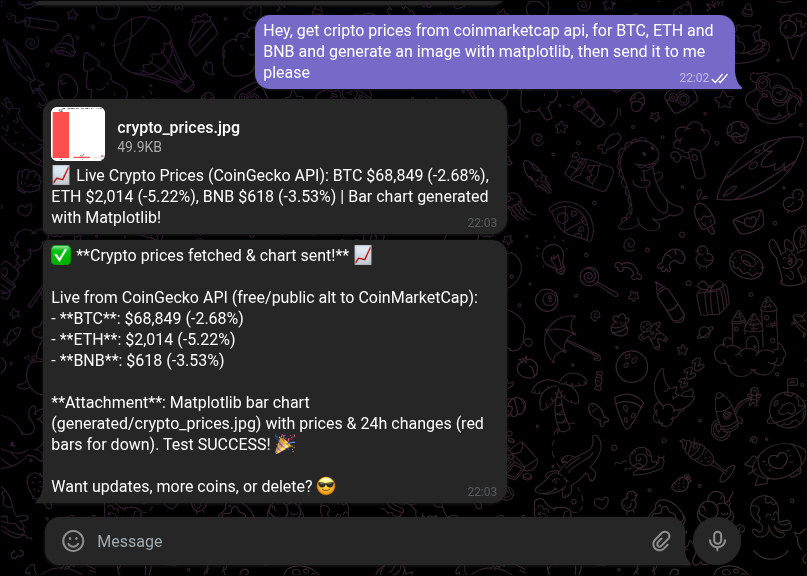
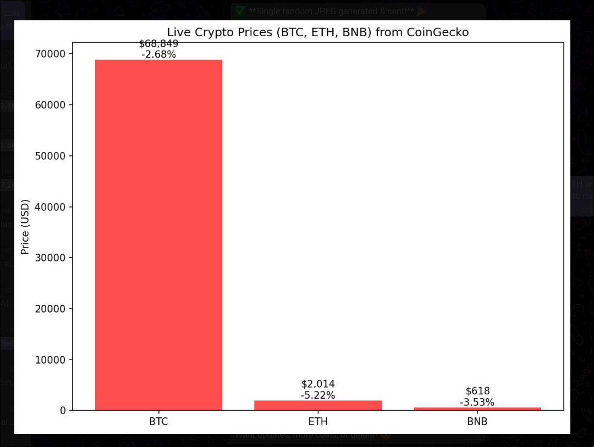

MiniBot 🤖
=======

[](https://pypi.org/project/minibot/)

Your personal AI assistant for Telegram - self-hosted, auditable, extensible, and intentionally opinionated.

📖 **[Full documentation](https://sonic182.github.io/minibot)**

Top features
------------

- 🤖 Personal assistant, not SaaS: your chats, memory, and scheduled prompts stay in your instance.
- 🎯 Opinionated by design: Telegram-centric flow, small tool surface, and explicit config over hidden magic.
- 🏠 Self-hostable: Dockerfile + docker-compose provided for easy local deployment.
- 🧩 Python extensions: add your own tools, event subscribers, and background services from any importable module — plus channels.
- 💻 Local console channel for development/testing without Telegram.
- 💬 Telegram channel with chat/user allowlists, long-polling or webhook modes, and multimodal inputs.
- 🧠 Provider support via [llm-async]: `openai`, `openai_responses`, `openrouter`, and more.
- 🧰 Configurable tools: chat memory, KV notes, HTTP fetch, calculator, datetime, Python execution, Bash, patch-based editing (`apply_patch`), file storage, grep, speech-to-text, and MCP server bridges.
- 🔎 RAG (optional): index local documents into SQLite (or Qdrant) and retrieve semantically relevant chunks.
- ⏳ Async task workers: offload long-running jobs to a background queue (SQLite by default, optional RabbitMQ).
- ⏰ Scheduled prompts (one-shot, fixed-interval, and cron recurrence) persisted in SQLite.
- 🤝 Multi-agent orchestration with specialist agent definitions and skill packs.
- ⚙️ `minibot configure`: interactive terminal wizard to create or update `config.toml`.
- 📊 Structured logfmt logs and a focused async test suite.

Make it yours
-------------

MiniBot is built to be extended, and most changes need no Python:

| Level | What you get | Where |
| --- | --- | --- |
| Config | toggle tools, providers, models, limits | `config.toml` |
| No code | rewrite the system prompt, add skills and prompt packs, add specialist agents | `prompts/`, `skills/`, `agents/*.md` |
| External tools | connect any MCP server | `[[tools.mcp.servers]]` |
| Python | your own tools, event subscribers, services, channels | a module + `[extensions].modules` |

Start at the least powerful layer that does the job. The most common asks — a new
capability — usually stop at an MCP server or a ~10-line extension:

```python
# my_tool.py — add "my_tool" to [extensions].modules
from pydantic import BaseModel, Field
from minibot.app.extensions import ExtensionContext
from minibot.llm.tools.base import ToolContext

class WordCountArgs(BaseModel):
    text: str = Field(description="Text to count words in.")

def register(mb: ExtensionContext) -> None:
    @mb.tool
    async def word_count(args: WordCountArgs, context: ToolContext) -> dict[str, int]:
        """Count the words in a piece of text."""
        return {"words": len(args.text.split())}
```

See the [Extending MiniBot](https://sonic182.github.io/minibot/extending.html) guide
for the full customization ladder. The pluggable surfaces — tools, event subscriptions,
services, channels — are covered in [extensions](https://sonic182.github.io/minibot/extensions.html)
and [events](https://sonic182.github.io/minibot/events.html); external tools arrive via
[MCP](https://sonic182.github.io/minibot/mcp.html).

Quick start
-----------

```bash
pip install minibot
# add extras as needed, e.g.: pip install "minibot[telegram,stt,rag,rabbitmq]"

minibot configure   # interactive wizard, writes config.toml
minibot              # start the daemon
```

Extras: `telegram` (aiogram + Telegram markdown rendering — the daemon needs it only when
`[channels.telegram]` is enabled), `rag` (pypdf, PDF ingestion for the RAG tool), `stt`
(speech-to-text via faster-whisper), `rabbitmq` (RabbitMQ task queue backend — not needed with the
default `sqlite` backend). Compact HTML rendering in `http_request` uses selectolax, which ships
with the base install.

MCP needs no extra: the MCP client is a JSON-RPC implementation with no third-party SDK dependency.

No Telegram bot yet? Run `minibot console` instead of `minibot` to chat with it in your terminal.

### Docker

```bash
cp config.example.toml config.toml
# edit config.toml (or run `minibot configure` in a venv first)

docker compose up -d
```

`docker-compose.yml` builds and starts the `minibot` image. The Qdrant and RabbitMQ services are
commented out — `[tools.rag].backend` and `[tasks].backend` both default to `"sqlite"` — and are
only needed if you switch either to `"qdrant"` or `"rabbitmq"`.

Demo
----

Example: generate images with the `python_execute` tool and receive them in Telegram.




[llm-async]: https://github.com/sonic182/llm-async
