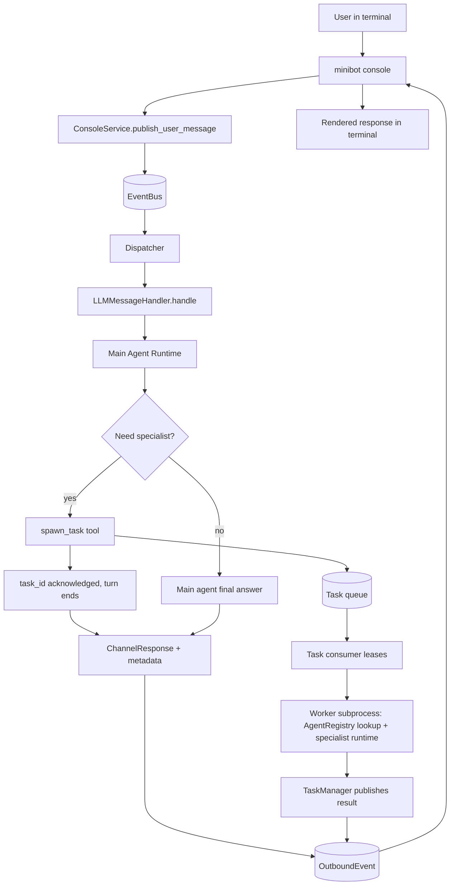

---
myst:
  html_meta:
    description: "Minibot architecture overview — hexagonal layout, runtime flow, subsystems, and where each module lives."
    keywords: "minibot architecture, hexagonal architecture, Python AI agent internals"
---

# Architecture

MiniBot is an asyncio application with two runtime entrypoints: **daemon mode**
(`minibot.app.daemon`) for Telegram, and **interactive CLI mode**
(`minibot.app.console`) for local console conversations. Both publish inbound events
to an internal event bus, route messages through the LLM pipeline, and emit outbound
responses back to the active channel adapter. A third, deliberately narrower
entrypoint is the forked task worker (`minibot.app.tasks.worker`).

## Guiding principles

- **Lightweight hexagonal split** — `core` (domain contracts), `app` (orchestration),
  `adapters` (infrastructure), `llm` (provider/tool integration).
- **Async-first** boundaries for I/O-heavy paths (Telegram, DB, provider calls).
- **Replaceable infrastructure** behind protocols (memory repositories, scheduled
  prompt store, tools, vector stores).
- **Explicit, testable flow** with dependency wiring centralized in the composition roots
  (`minibot.app.daemon` and `minibot.app.console`), which hand concrete adapters to the
  dispatcher instead of letting it resolve them through the container.

## Repository layout

Directories only; module-level detail lives in the linked pages below. Dependencies
point inward — `adapters` may import `core` and `config`; `core` imports none of
`app`, `adapters`, `llm` or `config`; `llm` never imports `app` or `adapters`; `app`
imports `adapters` only in the composition roots (`daemon`, `console`) and the task
worker.

```text
minibot/
  app/        orchestration: daemon, dispatcher, handler, agent runtime, tool factory,
              extensions API
    handlers/services/   LLM turn collaborators
    tasks/               task manager and the forked worker entrypoint
  config/     settings schema, `${ENV_VAR}` expansion, config path resolution
  core/       domain models + protocols (channels, events, files, tasks, MCP, memory)
  adapters/   infrastructure: config loading, container, logging, http, memory, graph,
              vectors, qdrant, messaging, scheduler, tasks (stores), files, mcp, vault
  llm/        provider factory + tool schemas/handlers (providers/, services/, tools/)
  extensions/ bundled extensions: thin register(mb) composition
  rag/        ingestion, chunking, embeddings, retrieval
  shared/     small cross-cutting helpers
```

## Runtime flow

1. Entry point (`minibot.app.daemon` or `minibot.app.console`) boots settings,
   logging, memory, tools, and dispatcher. The daemon first replays turns marked
   pending by a previous crash, then optionally starts the built-in HTTP server.
2. A channel adapter maps input into `ChannelMessage` and publishes `MessageEvent`.
3. `app.event_bus.EventBus` delivers the event to `app.dispatcher.Dispatcher`.
4. The dispatcher builds main-agent tool visibility (allow/deny policy, exclusive
   ownership mode) and invokes `LLMMessageHandler`.
5. The handler loads history, composes system prompt fragments, and builds tool context.
6. The main agent (`minibot`) runs its tool loop in `AgentRuntime`.
7. Delegation is tool-driven and asynchronous: `spawn_task` enqueues the work, the task
   consumer leases it, and a worker subprocess applies the specialist's tool policy and
   runs it. Its answer is published later as its own `OutboundEvent`.
8. The handler returns `ChannelResponse` with metadata (`primary_agent`, token trace).
9. The dispatcher publishes `OutboundEvent`; the active channel renders it to the user.
   If the handler raises, the dispatcher publishes `TurnFailedEvent` and a short generic
   failure reply, never the exception text.

The dispatcher awaits each turn before taking the next message, so turns run strictly one at a
time. One slow turn, or a tool approval wait (up to `[tools.approval].timeout_seconds`), queues
every message behind it. That fits a single owner; delegated tasks run in their own worker
processes and do not hold the queue.

## Console agent invocation


```mermaid
flowchart TD
    U[User in terminal] --> C[minibot console]
    C --> CS[ConsoleService.publish_user_message]
    CS --> EB[(EventBus)]
    EB --> D[Dispatcher]
    D --> H[LLMMessageHandler.handle]
    H --> SUP[Main Agent Runtime]
    SUP --> DEC{Need specialist?}
    DEC -->|no| FINAL[Main agent final answer]
    DEC -->|yes| ST[spawn_task tool]
    ST --> Q[(Task queue)]
    ST --> ACK[task_id acknowledged, turn ends]
    Q --> CON[Task consumer leases]
    CON --> W[Worker subprocess: AgentRegistry lookup + specialist runtime]
    W --> RES[TaskManager publishes result]
    ACK --> RESP[ChannelResponse + metadata]
    FINAL --> RESP
    RESP --> EB2[(OutboundEvent)]
    RES --> EB2
    EB2 --> C
    C --> U2[Rendered response in terminal]
```

## Layer map

- `config` — the `Settings` schema, environment expansion and config path resolution,
  shared by every layer.
- `core` — domain contracts: `AgentSpec`, runtime state, channel DTOs and
  `ChannelCapabilities`, events, file/MCP/memory/graph/task/vector protocols.
- `app` — event bus, dispatcher, `LLMMessageHandler` and its services, agent
  runtime/registry/policies, tool factory, extension API, guardrails, scheduler and
  task services (`app.tasks`: manager and worker).
- `adapters` — config loading, container, logging, the optional HTTP server,
  SQLite/SQLAlchemy memory, Telegram/console/RabbitMQ messaging (Telegram supplies its
  own `ChannelCapabilities`), scheduler persistence, task stores, local files, MCP
  clients, credential vault.
- `llm` — provider factory and services (request building, schema policy, tool
  execution, usage parsing, compaction), plus the LLM-facing tool schemas/handlers.
- `extensions` — bundled, opt-in `register(mb)` modules (tools, channels,
  integrations, services).
- `rag` — document ingestion, chunking, embeddings, reranking, retrieval.
- `shared` — generic helpers (prompt loading, frontmatter, paths, retries).

## Data and state

- Conversation history: SQLite transcript store (optional trimming/compaction), with an FTS5
  index over message text for the web UI's search.
- Pending turns: SQLite rows marking in-flight turns, replayed by the daemon after a crash.
- KV notes: optional SQLAlchemy-backed store under tool controls.
- Scheduled prompts: SQLite prompt store with recurrence + retry metadata.
- Vector index: whichever `VectorStore` backend `[tools.rag]` selects.
- Credentials: encrypted `secrets.vault.yml`, decrypted into process memory only.

## Where to go next

- Extending MiniBot: {doc}`extending`, {doc}`extensions`, {doc}`extension-api`, {doc}`events`
- Agents and prompts: {doc}`agents`, {doc}`prompts`
- Tools and integrations: {doc}`tools`, {doc}`mcp`, {doc}`tasks`, {doc}`scheduler`, {doc}`graph`
- Providers: {doc}`providers`
- Retrieval and media: {doc}`rag`, {doc}`audio`
- Operations: {doc}`config`, {doc}`cli`, {doc}`security`, {doc}`vault`
