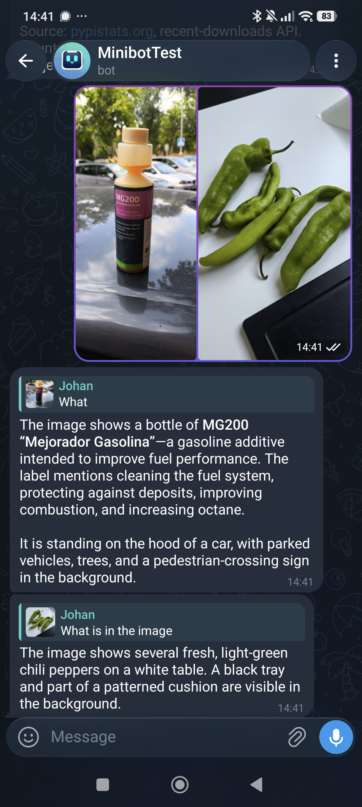
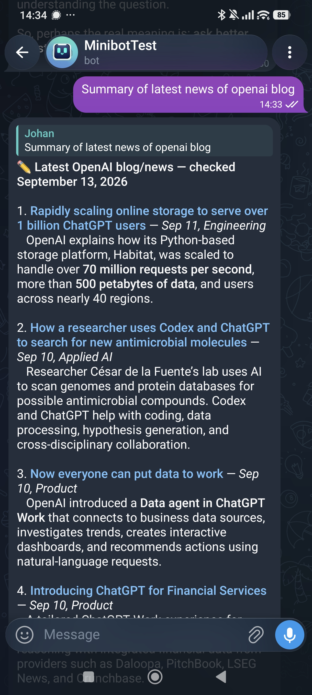
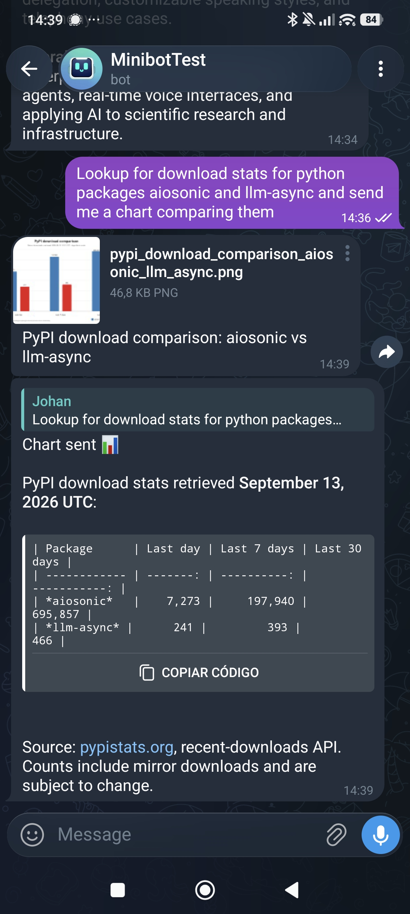
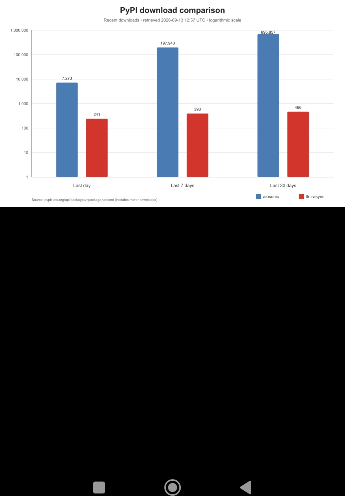
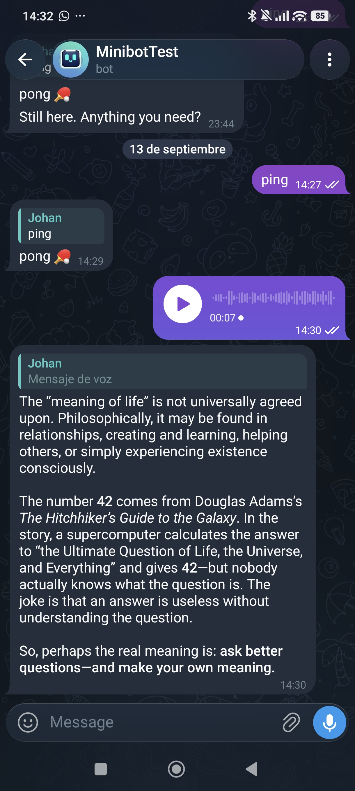

Demo
====

.. meta::
   :description: Screenshots of Minibot understanding images, summarizing web pages,
      generating charts, and transcribing voice messages in Telegram.

Screenshots of Minibot in action over Telegram.

.. raw:: html

   

   

     

       
Understand photos sent in chat

.. raw:: html

     

     

       
Browse the web and summarize a page

.. raw:: html

     

     

       
Fetch data and generate a chart

       
Uses <code>http_request</code> + <code>python_execute</code>

       

.. raw:: html

       

     

     

       
Transcribe voice messages

       
Requires the <code>stt</code> extra: <code>pip install "minibot[stt]"</code>

.. raw:: html

     

   

